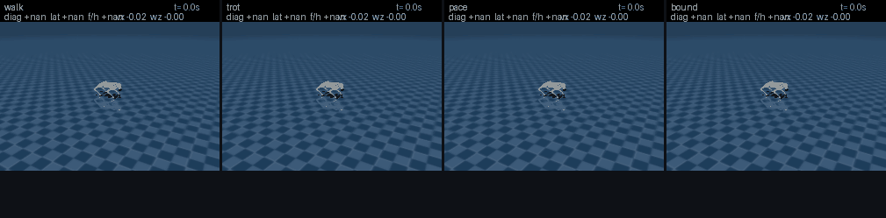
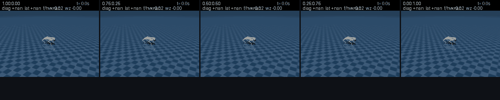
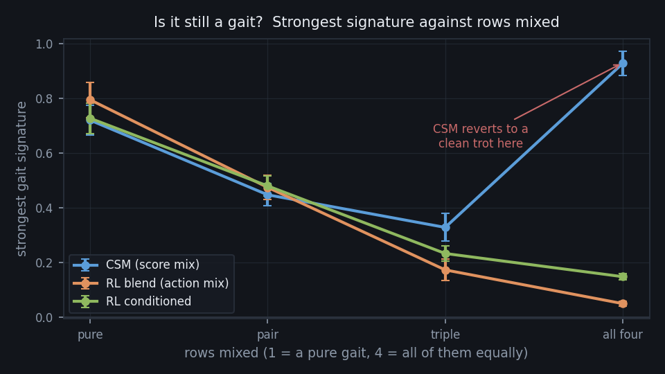
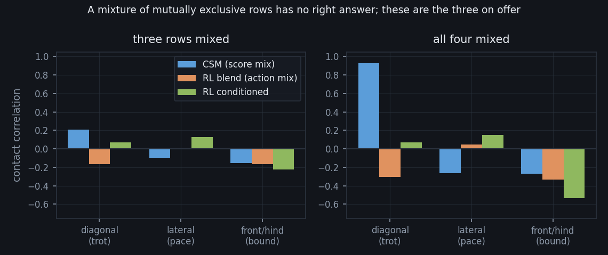
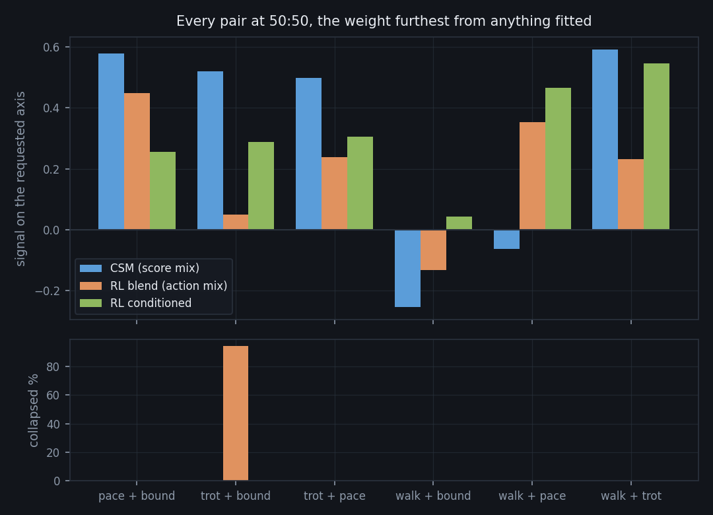
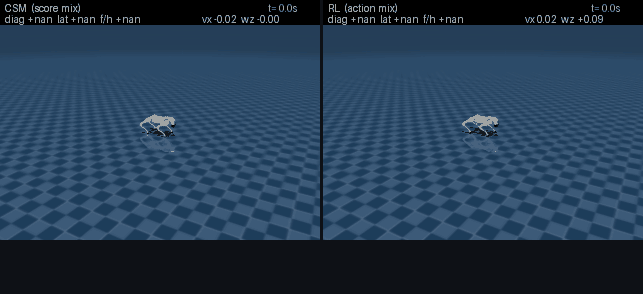
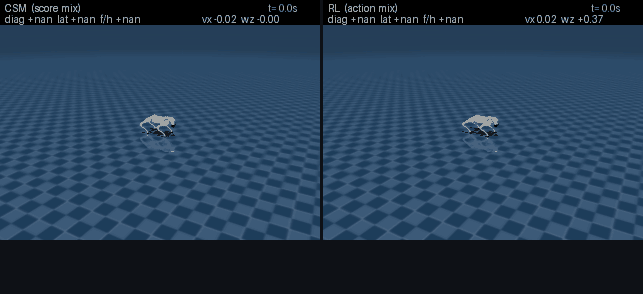
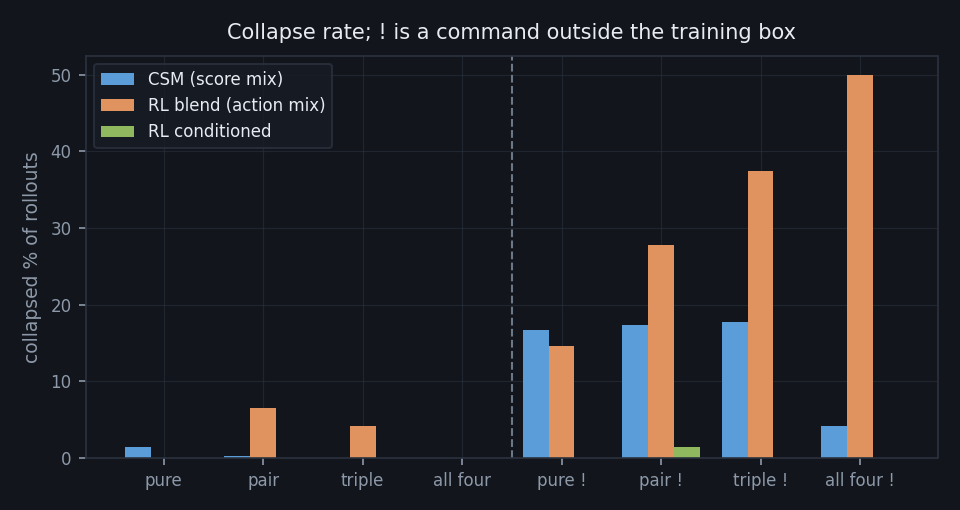
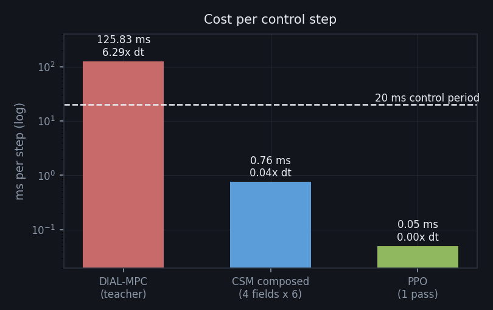

# 보행 스타일 기저: 세 개의 침묵한 결함과, CSM이 실제로 사는 것

## 0. 이 과제가 물은 것

지금까지의 모든 기저에는 **하나의 궁극적 목표**가 있었고 행들은 그 목표에 이르는
디테일만 조정했다. 그래서 행들이 argmin을 공유했고 `omega`가 결정하는 것이
거의 없었다. 보행 스타일은 정반대다 — trot은 대각 발을 함께 딛고, pace는 같은 쪽
발을, bound는 앞뒤 쌍을 딛는다. **상호배타적이고, 어떤 weight도 둘을 동시에
만족시킬 수 없다.** `omega`는 처음으로 대등한 대안 사이의 진짜 선택을 강요받는다.

그 위에서 물을 수 있는 질문이 CSM의 핵심 주장이다: **적합된 적 없는 중간
weight에서, 행렬 해 하나로 중간 걸음이 나오는가?** 그리고 그것은 RL이 못 하는
일인가?

이 문서는 그 답과, 답에 이르기까지 **다섯 라운드를 삼킨 세 개의 결함**을 기록한다.
세 결함의 공통점이 결론보다 중요하다: **어느 것도 학습 알고리즘의 문제가 아니었고,
셋 다 "측정되지 않아서" 숨었다.**

---

## 1. 다섯 번의 실패

목적함수(`unitree_go2_gait`)는 네 gait 행에 공통 floor(자세·높이·속도)를 더한
형태다. 첫 다섯 라운드에서 CSM 학생은 **trot과 pace를 전혀 만들지 못했다.**
데이터 증강, DAgger, 위상 관측 추가, horizon 연장, gait별 수집 — 전부 실패했고,
그 시점의 결론은 "시간 협응이 필요한 gait는 증류할 수 없다"였다.

**그 결론은 틀렸다.** 아래 세 절이 진짜 원인이다.

---

## 2. 결함 ① — 라벨을 만든 선생이 걷지 않았다

gait 검증은 `std_normalize=True`로 했고, **수집 드라이버와 라벨은 raw Gibbs**
(`std_normalize=False`, `collect_cli.py:113`)를 썼다. 같은 목적함수, 같은 T,
같은 하네스에서 규약만 바꾸면:

| 규약 | walk | trot | pace | bound | 속도(명령 0.6) | 발 최고 높이 |
|---|---|---|---|---|---|---|
| `std_normalize=True` (검증에 쓴 것) | 0.27 | 0.88 | 0.82 | 0.91 | 0.47~0.53 | 0.016~0.037 |
| **raw Gibbs (실제로 수집한 것)** | nan | nan | nan | nan | 0.13~0.22 | **≈0.000** |

`nan`은 접촉 패턴에 변화가 없다는 뜻 — **발이 지면을 아예 떠나지 않는다.** 목표
진폭 0.08 m에 실제 0.000이다. 끌며 간다. 저장된 클라우드의 `qvel`이 이를 확인한다:
수집 내내 로봇은 명령 0.6~1.0에 대해 **0.19~0.27 m/s**로 움직였다.

**학생은 선생을 넘을 수 없다.** 다섯 라운드는 걷지 않는 선생을 증류하고 있었다.

`std_normalize`로 바꾸는 것은 답이 아니다 — 그것은 CSM 합성이 딛는 ν-선형성을
깨뜨린다. 답은 목적함수였다: gait 항이 `gait_scale: 1.551`로 **×0.064**에
불과했고, floor(0.3+0.3)에 눌려 샘플 return 산포의 7%만 움직였다. softmax는
자세로만 샘플을 골랐다.

`gait_scale 0.2`(×0.5) + `track_floor 2.5`로 올리자 raw Gibbs에서 **네 gait 전부**
0.90~0.93 패턴에 낙상 0이 됐다. 패턴을 올리면 추종을 잃고 이어서 안정성을 잃지만
(×1.0, track 0.3에서 9롤아웃 중 낙상 18), **추종 floor를 함께 올리면 둘 다
회복된다** — floor가 패턴 아래에서 로봇을 계속 움직이게 하는 역할이기 때문이다.

---

## 3. 결함 ② — 높이 필터가 웅크림 대역을 잘랐다

목적함수를 고치자 trot과 pace는 살아났지만 **walk와 bound는 여전히 실패**했다.
네 field의 적합 품질은 구분이 불가능했다 — val_relative_rms 0.856~0.864, 라벨
노이즈 74~78%, ESS 5.5~6.8%. **validation이 동일한데 control이 정반대**다.

몸통 높이 궤적을 직접 읽자 원인이 보였다. trot은 몸통을 0.27~0.28 m로 유지한다.
walk·bound 학생은 처음부터 낮게(0.20~0.22) 걷다가 **네 발을 모두 딛은 채** 더
가라앉아 0.18 m `done` 선을 넘고, 회복 없이 **−0.22 m — 지면 아래 22 cm**에
정착한다(이 모델은 발만 바닥과 충돌한다).

원인은 전처리 한 줄이었다. `fit_from_clouds --min-height 0.25`는 base 높이로
거르는데 **로봇 기립이 0.28 m**다. 즉 **0.19~0.25 m 웅크림 대역 — 전체의 15%,
25,160행 —** 이 통째로 학습에서 빠졌고, 그 대역이 정확히 walk·bound가 걷는
높이다. field는 거기서 라벨을 한 번도 못 봤고 아래로 외삽했다.

**0.19로 바꾸는 것만으로 bound 낙상 1059 → 0.** 같은 데이터, 같은 적합, 같은
온도였다. DAgger가 모으는 상태가 바로 그 대역이므로 이 설정은 두 번 중요하다 —
0.25로 재적합하면 DAgger가 방금 모은 데이터를 스스로 버린다.

---

## 4. 결함 ③ — 목적함수에 heading이 없었다

여기까지로 네 gait를 1500 step 유지하는 정책이 나왔다. 그런데 **뷰어를 띄워
보고서야** 드러난 것이 있다 — 명령이 `vy = wz = 0`인데 로봇이 **원을 그린다.**

보상 어디에도 로봇이 어느 쪽을 보는지가 없었다. 이 env는 부모의 보상을 새로
쓰면서 `reward_yaw`를 빠뜨렸고 `yaw_tar`를 진행시키지도 않아, `ang_vel_tar`
(= vyaw 명령, 뷰어의 yaw 슬라이더)가 **죽은 값**이었다.

DIAL은 이를 가렸다. 2049개 샘플 구름은 대칭이라 선생은 −0.02~+0.07 rad/s만
흘렀다. **대칭이 없는 학생은 gait마다 제 방향으로 돌았다** — walk +0.34, pace
−0.24 rad/s, 좌우 대칭인 bound만 거의 직진.

부모의 설계를 그대로 가져왔다: `reward_yaw`를 추종 floor에 `yaw_weight` 가중으로
넣고, `yaw_tar`를 명령 rate로 진행시킨다. **yaw-rate 항은 의도적으로 두지
않는다** — heading은 rate의 적분이라 둘 다 두면 행이 공선이 되고, 부모의 측정에
따르면 선회 명령에서만 16회 중 12회 실패했다.

DIAL로 `yaw_weight`를 쓸었다(네 gait × 네 명령, 0을 대조군으로):

| yaw_weight | 최소 패턴 | 평균 패턴 | \|drift\| 최대 | 선회 오차 최대 | vx/cmd |
|---|---|---|---|---|---|
| **0.0** (기존) | 0.28 | 0.72 | **82°** | **0.45 rad/s** | 0.88 |
| 0.3 | 0.28 | 0.71 | 13° | 0.08 | 0.87 |
| **0.6** (채택) | 0.28 | **0.72** | **9°** | **0.06** | 0.87 |
| 1.0 | 0.28 | 0.71 | 11° | 0.06 | 0.86 |

**패턴과 속도를 전혀 내주지 않는다.** heading은 공짜였다. 0에서는 선생조차
선회 명령을 무시했고(오차 0.45 rad/s), pace는 **순수 횡이동 명령에도 −28°**
돌았다 — heading이 없으면 vy 추종도 온전하지 않았다.

온도는 재측정 후 **0.15 유지**. heading이 공통 floor에 들어갔으니 라벨의 gait
몫이 줄 것으로 예상했으나 실제로는 0.351 → 0.348, ESS 7.6% → 7.4%로 거의 변화가
없었다 — 로봇이 heading을 잘 따라가는 동안 `reward_yaw ≈ 0`이라 return 산포에
기여가 작기 때문이다.

---

## 5. 최종 정책

새 목적함수로 재수집(2000 step × 8 env, repeats 8, T=0.15) → 적합(필터 0.19) →
**DAgger 한 라운드** → 재적합. DAgger 이전에는 bound만 망가져 있었고(0.57, drift
152°), 한 라운드가 그것을 고쳤다(0.86, drift 4°) — 동시에 저명령 과속도 1.22 →
1.05로 잡혔다.

**1500 step(30초) 검증, 네 gait × (직진 3 + 30초 선회) = 16/16 전부 무붕괴:**

| gait | 후반 패턴 | heading 오차 | 선회 +0.3 달성 |
|---|---|---|---|
| walk | 0.26 | +1° | 0.33 |
| trot | 0.93 | +6~+11° | 0.28 |
| pace | 0.85 | −16~+3° | 0.30 |
| bound | 0.85 | −2~+12° | 0.26 |



*네 기저 gait. 오른쪽 접지 다이어그램(FL/FR/RL/RR × 최근 3초)에서 짝짓기가 직접
보인다 — trot은 대각이 정렬되고, pace는 같은 쪽, bound는 앞 쌍 다음 뒤 쌍, walk은
네 박자로 흐른다.*

---

## 6. 합성: 적합된 적 없는 weight에서

여섯 쌍 × 다섯 비율, 그리고 3-way·4-way 혼합을, **RL 세 팔과 같은 잣대로** 쟀다.

**비교 설계.** 세 팔 모두 같은 관측에서 행동을 낸다.

- **CSM** — 합성된 score field, step당 6회 refine
- **RL 블렌딩** — 전문가들을 omega 계수로 평균. 순수 weight면 그 gait의 전문가로,
  쌍이면 2개 평균, 3-way면 3개 평균으로 자동 환원된다. **CSM field가 받는 계수와
  정확히 같은 것**을 쓴다.
- **RL 조건부** — omega를 입력으로 받는 PPO 하나. "한 번 학습해 cone 전체를
  서비스한다"는 CSM 자신의 주장을 RL로 한 것이고, **정직한 강한 상대**다.

**표본.** 초기 상태를 무작위화(높이 ±0.02 m, 자세·관절 ±0.05 rad)하고 같은 배치를
모든 팔에 넘겼다. 27 weight × 10 명령 × 6 시드 × 3 팔 = 810행. 이 문단이 중요한
이유는 아래 7절에 있다.



*trot(왼쪽)에서 pace(오른쪽)로, 다섯 지점. 가운데 셋은 **어떤 field도 적합된 적
없는 weight**이고, 행렬 해 하나로 얻는다. 접지 다이어그램에서 대각 정렬이 풀리고
같은 쪽 정렬이 들어서는 것이 보인다.*



**혼합 차수가 올라갈수록 행동 평균은 뭉개지고 score 합성은 버틴다** — 0.79 →
0.58 → 0.17 → 0.05 대 0.72 → 0.51 → 0.33. 다만 **4-way의 0.93은 CSM의 장점이
아니다.**



축별로 보면 드러난다: 4-way 균등 요청에서 CSM은 **대각 1.00의 완벽한 trot**을
내놓는다. 나머지 세 요청을 무시하고 기저 행 하나로 되돌아간 것이다. 상호배타적인
넷을 균등 요청하는 데 정답이 없다는 점을 감안해도, "CSM이 4-way에서 압도적"이라는
읽기는 틀렸다. 정확한 서술은 이것이다: **깊은 혼합에서 RL 행동 평균은 gait 구조가
없는 동작이 되고(속도도 0.80까지 잃는다), CSM은 구조를 가진 gait를 유지하되 그
방식이 보간이 아니라 한 행으로의 회귀일 수 있다.**



**쌍별 50:50에서는 평균이 가리던 것이 보인다.** trot+bound에서 **RL 블렌딩이 94%
붕괴**하는 동안 CSM은 0%다. trot+pace(0.50 대 0.24)와 pace+bound(0.58 대 0.45)도
CSM이 낫다. 반대로 **walk+pace는 RL이 낫고**(0.35 대 −0.06), walk+bound는 셋 다
못 한다. **일률적 승리가 아니라 쌍에 따라 갈린다.**



*trot+bound 50:50 — 같은 weight, 같은 리셋. 왼쪽이 score 합성, 오른쪽이 행동
평균. 이 쌍이 두 방법이 가장 크게 갈리는 지점이다(붕괴 0% 대 94%).*



*trot+pace 50:50 — 둘 다 무붕괴지만 신호가 다르다(0.50 대 0.24). 행동을 평균하면
어느 쪽도 아닌 동작이 되고, score를 섞으면 하나의 gait로 결단한다.*

---

## 7. 범위 밖 명령

학습 명령 상자는 vx 0.6~1.0, vy ±0.15, vyaw ±0.3이다. 그 밖에서:



| 명령 | CSM 붕괴 | RL 블렌딩 | **RL 조건부** |
|---|---|---|---|
| vx 1.3 | 2% | 33% | **0%** |
| vx 1.6 | 36% | 73% | **4%** |
| vyaw 0.6 | 0% | 4% | **0%** |
| vx 0.3 | 30% | 2% | **0%** |

**조건부 RL 정책이 압도적으로 강건하다** — 상자 밖 전 구간에서 사실상 무붕괴다.
CSM은 상자 위(vx 1.6)에서 36%, **상자 아래(vx 0.3)에서 30%** 무너진다. 후자의
이유는 명확하다: CSM은 vx 0.3 명령에 **1.60배로 과속**한다(0.48 m/s로 주행).
학습 범위 아래로 내려가지 못한다. 조건부 RL은 0.99다.

속도 추종 전반도 조건부 RL이 가장 정확하다(0.92~1.01), CSM은 상시 과속
(1.05, 최대 1.82), RL 블렌딩은 미달(0.92, 최소 0.55).

heading은 세 팔 모두 평균 4°로 동등하다(p90: CSM 9°, RL 6°).

---

## 8. 런타임 — 비교 이전의 문제



| 컨트롤러 | ms/step | × dt(20 ms) | Hz |
|---|---|---|---|
| **DIAL-MPC (선생)** | **125.83** | **6.3×** | 8 |
| CSM 합성 (4 field × 6 pass) | 0.76 | 0.04× | 1322 |
| PPO (1 forward) | 0.05 | 0.003× | 20929 |

**선생은 50 Hz 제어 주기에서 실행될 수 없다** — 6.3배 초과다. 품질을 비교하기
이전에 DIAL은 배포 대상이 아니고, 그것이 증류가 존재하는 이유다. CSM은 166배,
PPO는 2634배 빠르다. 둘 다 예산 안에 크게 여유가 있어 이 축에서는 실질적 차이가
없다.

---

## 9. 결론

**순수 gait에서는 PPO가 이긴다.** pace 0.96~1.00 대 CSM 0.82~0.88, bound
0.96~1.00 대 0.71~0.87, 속도·heading도 대등하거나 낫다. 비용은 **gait당 4.3분**
대 CSM 경로의 약 **15시간**(수집 7h + DAgger 5h + 적합 3h)이다.

**"합성은 CSM으로만 가능하다"는 거짓이다.** 행동 평균도 쌍에서는 보간한다.

**CSM이 실제로 사는 것은 좁고 구체적이다:**
- 혼합 차수가 깊어질수록 **구조를 가진 gait를 유지**한다. 행동 평균은 3-way에서
  0.17, 4-way에서 0.05로 붕괴한다.
- 가장 대립적인 쌍(trot+bound)에서 **붕괴하지 않는다**(0% 대 94%).
- 비율마다 재학습이 필요 없다 — 행렬 해 하나다.

**CSM이 잃는 것도 분명하다:**
- 순수 gait 품질에서 PPO에 진다.
- 명령 상자 밖, **특히 아래쪽에서 무너진다**(vx 0.3에서 30% 붕괴, 1.60배 과속).
- 4-way에서 "보간"이 아니라 한 행으로 회귀한다.

**omega-조건부 PPO가 가장 균형 잡힌 팔이다.** 순수 gait는 CSM과 대등하고, 속도
추종이 가장 정확하며, 상자 밖에서 유일하게 무너지지 않는다. 약점은 깊은 혼합의
신호가 가장 약하다는 것(3-way 0.23, 4-way 0.15)과 전문가 대비 학습 보상이 4배
비싸다는 것이다.

정직한 요약은 이렇다: **이 과제에서 CSM의 가치는 "합성 가능성"이 아니라 "깊은
혼합에서의 결단력과 대립적 쌍에서의 안정성"이고, 그 대가로 순수 성능과 외삽
강건성을 내준다.**

---

## 10. 방법론적 교훈

세 결함 모두 **목적함수가 통제한다고 주장하는 것을 아무도 재지 않아서** 숨었다.
heading은 보상에도 검증기에도 없었고, 두 부재가 서로를 가렸다.

그리고 **검증기 자체가 두 번 틀렸다:**

- **"시드 3개"가 동일 롤아웃이었다.** 학생은 결정론적이고 `reset`은 초기 상태를
  무작위화하지 않는다(`randomize_start_state`가 gate하는 노이즈 필드가 전부
  0.0이다). 실제 다양성은 명령 축뿐이었고, 이 프로젝트가 기대던 중간점 격차
  (0.57 대 0.16)는 **표본 1개 대 1개**였다. 제대로 표본을 잡자 쌍 평균 격차는
  사라졌고(0.45 대 0.47), 진짜 구조는 **혼합 차수**와 **특정 쌍**에 있었다.
- **일시적 dip을 사망으로 셌다.** `done`은 매 step 재계산되는 비끈적 플래그(몸통
  0.18 m 미만)이고 학생 루프는 리셋하지 않는다. 첫 `done`을 죽음으로 처리한
  검증기는 램프 중 한 번 스치고 30초를 멀쩡히 걸은 정책을 "0/3 생존"으로
  보고했다. 붕괴는 **done 100 step 연속 또는 종료 높이 <0.15 m**로 정의해야 한다.

RL 쪽에서도 같은 종류의 함정이 있었다. 이 목적함수는 전 행이 비용이고 생존
보너스가 없어, **종료를 허용하면 즉시 넘어지는 것이 최적**이다. 첫 학습에서 다섯
정책 모두 평균 에피소드 **7.6 step**(1500 중)으로 수렴했고 보상 곡선은 −56.8 →
−4.9로 "개선"됐다 — 더 빨리 죽는 법을 배운 것이다. `FixedHorizonWrapper`가 바로
이 때문에 존재하고, `csm/CLAUDE.md`에 이미 적혀 있었다. **보행 학습은 보상보다
에피소드 길이를 먼저 봐야 한다.**

---

## 부록 — 재현

목적함수·온도·필터는 전부 측정으로 정해졌고 `csm/gait/`에 스크립트가 있다.

```bash
# 목적함수 선택
python csm/gait/gaitscale2.py                 # gait 항 강도 (raw Gibbs)
python csm/gait/gait_pick.py                  # gait_scale x track_floor
python csm/gait/gait_yaw_pick.py 0.0 0.3 0.6 1.0   # heading 가중치
python csm/gait/gait_yaw_temp.py              # 온도, ESS, 라벨의 gait 몫

# 수집 -> 적합 -> DAgger -> 검증
bash csm/gait/pipeline.sh

# RL
bash csm/gait/rl_train.sh                     # 전문가 4 + 조건부 1
bash csm/gait/rl_compare.sh

# 비교와 그림
python csm/gait/head2head.py --weights all --commands inbox --seeds 6 ...
python csm/gait/runtime.py ...
python csm/gait/plots.py
bash csm/gait/render_all.sh
```

각 스크립트가 어떤 함정을 잡으려고 만들어졌는지는 `csm/gait/README.md`에 있다.
