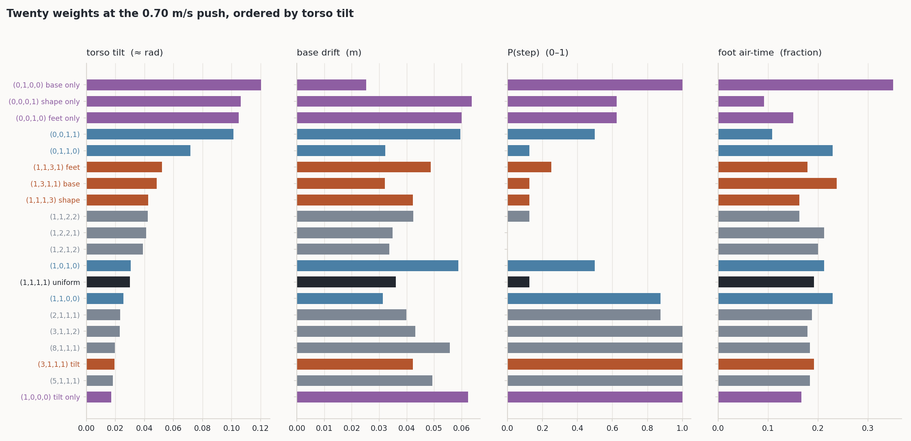
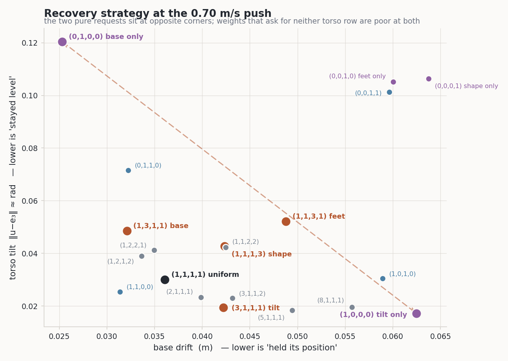
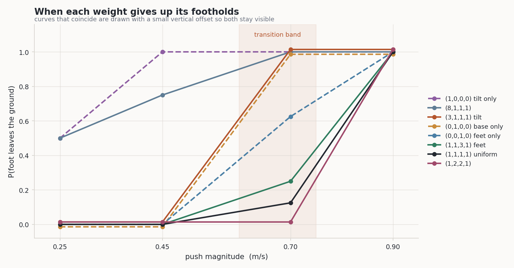
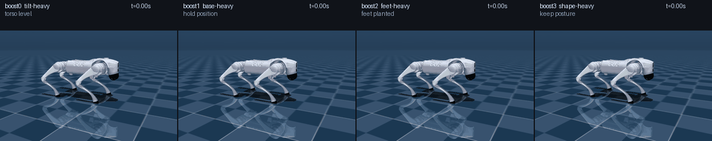
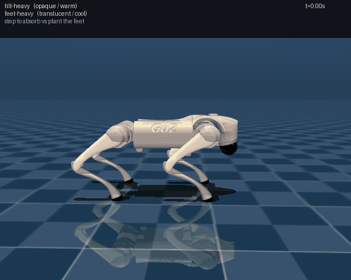

# 외란에 버티는 4족 로봇 제어기: preference weight를 실시간으로 바꿀 수 있는 학습형 컨트롤러

## 요약

네 발 로봇(Unitree Go2)이 제자리에 서 있다가 옆에서 밀렸을 때 버티는 문제를 다룬다.
"어떻게 버틸 것인가"는 하나로 정해지지 않는다. 몸통을 수평으로 유지할 수도 있고, 서
있던 자리를 지킬 수도 있고, 발을 떼지 않을 수도 있다. 이 셋은 물리적으로 동시에
만족될 수 없다.

이 프로젝트는 그 선택지를 **네 개의 숫자(preference weight)** 로 표현하고, 사용자가
런타임에 그 숫자를 바꾸면 로봇의 회복 전략이 즉시 달라지는 컨트롤러를 만들었다.
핵심은 **네 개의 network만 학습해 두고, 임의의 weight 조합을 그 네 개의 선형
결합으로 즉석에서 만들어 내는 것**이다.

결과: reference 컨트롤러 대비 성능 비율 **1.144배**(1.0이 동일), 8개 목표 weight
전부에서 **낙상 0회**, 실행 속도는 reference 대비 **17.6배 빠름**. 그리고 weight를
바꾸면 회복 전략이 실제로, 눈에 보이게 달라진다.

---

## 1. 이론적 배경

### 1.1 문제 설정

로봇은 제자리에 서 있고, 무작위 시점에 몸통에 외란이 가해진다. 컨트롤러는 12개
관절의 목표 토크를 50 Hz로 내보내며 넘어지지 않고 버텨야 한다.

#### 외란을 주는 방식

외란은 **몸통의 속도를 한 순간에 더해 주는 방식**으로 준다. 시뮬레이터의 상태
변수 중 몸통 병진 속도 $v \in \mathbb{R}^3$ 에 대해 한 제어 스텝에서

$$v \leftarrow v + \Delta v, \qquad
\Delta v = (\lVert\Delta v\rVert\cos\theta,\ \lVert\Delta v\rVert\sin\theta,\ 0)$$

로 갱신한다. $\theta$ 는 수평면 안의 방향이고, 나머지 상태(관절 각도, 관절 속도,
몸통 자세)는 건드리지 않는다.

**단위가 m/s인 이유가 여기에 있다.** 힘이나 토크를 시간에 걸쳐 가하는 것이 아니라
속도 자체를 즉시 바꾸므로, 외란의 크기는 "몸통이 얼마나 빠르게 밀려났는가"로
표현된다. 이것은 물리적으로 **순간 impulse** 와 같다. 로봇 총질량이 $m = 15.21$ kg
이므로

$$J = m\,\lVert\Delta v\rVert$$

| $\lVert\Delta v\rVert$ | impulse $J$ | 한 제어 스텝(20 ms) 동안 가한 등가 힘 |
|---|---|---|
| 0.25 m/s | 3.80 N·s | 190 N |
| 0.45 m/s | 6.84 N·s | 342 N |
| 0.70 m/s | 10.64 N·s | 532 N |
| 0.90 m/s | 13.69 N·s | 684 N |
| 1.20 m/s | 18.25 N·s | 912 N |

0.70 m/s는 사람이 로봇 몸통을 옆에서 한 번 세게 밀치는 정도에 해당한다.

속도를 직접 바꾸는 방식을 택한 이유는 두 가지다. 첫째, 충격의 세기가 접촉 시간이나
접촉 강성 같은 부수적 파라미터에 의존하지 않아 **재현 가능한 하나의 숫자로 외란을
지정**할 수 있다. 둘째, 세기와 방향 두 값만으로 외란 공간 전체를 훑을 수 있다.

한 가지 중요한 구현 세부가 있다. 이 외란은 **컨트롤러가 볼 수 없는 곳에서** 가한다.
reference 컨트롤러는 내부적으로 같은 시뮬레이터 함수를 호출해 미래를 예측하므로,
외란을 시뮬레이터의 한 스텝 안에 넣으면 2049개 예측 sample 전부가 다가올 충격을 미리
알고 대비하게 된다. 그러면 "예상치 못한 밀침에 대응한다"는 문제 자체가 사라진다.
그래서 외란은 제어 스텝과 제어 스텝 **사이**에 적용한다.

"잘 버텼는지"를 평가하는 항목을 네 가지로 나눈다. 세 항목은 nominal 상태로부터의
편차에 대한 quadratic penalty이고, feet 항목만 여기에 이산 항 하나가 더 붙는다.

| 이름 | 측정 대상 | 좌표계 |
|---|---|---|
| **tilt** | 몸통이 얼마나 기울었는가 | 방향만 (위치 무관) |
| **base** | 몸통 중심이 원래 자리에서 얼마나 벗어났는가 | world |
| **feet** | 네 발이 처음 딛고 있던 지점에서 얼마나 움직였는가 | **world** |
| **shape** | 관절 각도가 기본 자세에서 얼마나 벗어났는가 | **몸통 기준 상대** |

#### 네 항목의 수식

기호를 먼저 정한다. $R$ 은 몸통의 회전행렬, $e_3 = (0,0,1)$, 그리고

$$\hat u := R\,e_3$$

는 **몸통의 위쪽 축을 world 좌표에서 본 것**이다. $p \in \mathbb{R}^3$ 는 몸통
중심 위치, $f_k \in \mathbb{R}^3$ ($k = 1,\dots,4$)는 각 발 site의 world 위치,
$q \in \mathbb{R}^{12}$ 는 관절 각도다. 윗줄 바 표시($\bar p_{xy}$, $\bar f_k$,
$\bar q$)는 **home keyframe에서 한 번 계산해 상수로 고정한 nominal 값**이다. 리셋
자세가 고정이므로 이 world 좌표 목표들은 에피소드 내내 상수다.

$$
\begin{aligned}
C_{\text{tilt}}(x)  &= -\frac{\lVert \hat u - e_3 \rVert^2}{s_{\text{tilt}}} \\[6pt]
C_{\text{base}}(x)  &= -\frac{\lVert p_{xy} - \bar p_{xy} \rVert^2
                          + (p_z - h^\star)^2}{s_{\text{base}}} \\[6pt]
C_{\text{feet}}(x)  &= -\left(
      \frac{\sum_{k=1}^{4} \lVert f_k - \bar f_k \rVert^2}{s_{\text{foot}}}
      \;+\; \lambda\, n_{\text{lift}} \right),
    \qquad n_{\text{lift}} = \sum_{k=1}^{4}
      \mathbb{1}\big[\, f_{k,z} - r_{\text{foot}} > 10^{-3} \,\big] \\[6pt]
C_{\text{shape}}(x) &= -\frac{\lVert q - \bar q \rVert^2}{s_{\text{shape}}}
\end{aligned}
$$

몇 가지 짚어 둘 것이 있다.

**tilt는 기울기 각도만의 함수다.** $\hat u$ 와 $e_3$ 가 모두 단위벡터이므로

$$\lVert \hat u - e_3 \rVert^2 = 2\,(1 - \cos\theta) \;\approx\; \theta^2$$

이고, $\theta$ 는 몸통 위쪽 축이 연직에서 벗어난 각도다. **yaw는 전혀 들어가지
않는다** — $\hat u$ 는 yaw 회전에 불변이다. 즉 이 항목은 "얼마나 누웠는가"만 보고
"어느 쪽을 보는가"는 보지 않는다.

**base는 높이까지 포함한다.** 수평 이탈뿐 아니라 $h^\star = 0.30$ m로부터의 높이
편차도 같은 항에 들어간다. 몸을 낮춰 버티는 것도 이 항목에서는 대가다.

**feet의 이산 항이 유일한 비 quadratic 성분이다.** $\lambda\, n_{\text{lift}}$ 는
발이 지면에서 떨어진 개수를 세어 발당 $\lambda = 0.5$ 를 부과한다. 미끄러진 거리와
별개로 **접촉을 끊는 행위 자체에 값을 매기는 것**이며, §3.3에서 "발을 떼는 확률"이
weight에 따라 0.00에서 1.00까지 갈리는 것이 이 항 때문이다. 연속 항만 있으면 발을
살짝 떼는 것과 붙인 채 미끄러지는 것이 구분되지 않는다.

**shape만 몸통 기준이다.** $q$ 는 관절 각도이므로 몸통이 어디에 어떤 자세로 있든
무관하다. §1.1 뒤에서 설명하는 feet와 shape의 분리가 여기서 나온다.

#### 행 정규화 상수 $s$ 는 임의의 값이 아니다

$$s_{\text{tilt}} = 0.04, \quad s_{\text{base}} = 0.01, \quad
s_{\text{foot}} = 0.04, \quad s_{\text{shape}} = 1.0, \quad \lambda = 0.5$$

각 항목이 **"적당한 크기의 편차"에서 정확히 $-1$ 을 읽도록** 맞춘 값이다.

| 항목 | 기준 편차 | 계산 | 값 |
|---|---|---|---|
| tilt | 기울기 0.2 rad | $2(1-\cos 0.2) / 0.04$ | $-1.00$ |
| base | 중심 이탈 0.10 m | $0.10^2 / 0.01$ | $-1.00$ |
| feet | 발마다 0.10 m 미끄러짐 | $4 \times 0.10^2 / 0.04$ | $-1.00$ |
| shape | 전 관절 0.3 rad | $12 \times 0.3^2 / 1.0$ | $-1.08$ |

**이 정규화가 없으면 weight 격자가 의미를 잃는다.** 한 항목의 원시 크기가 다른
것의 수십 배면 어떤 $\omega$ 를 주든 그 항목이 목적함수를 지배하고, weight를 바꿔도
argmax가 움직이지 않는다. 같은 이유로 [보행 task](walking_report_ko.md#32-세-항목의-크기를-맞췄다)
에서도 행 정규화를 측정해서 넣었다 — 다만 그쪽은 기준 편차를 정하는 대신 sample
cloud 위에서 각 항목의 표준편차를 직접 재서 맞췄다.

#### 종료 조건

$$\text{done} \;=\; \big[\, \hat u \cdot e_3 < 0 \,\big]
\;\lor\; \big[\, p_z < 0.15 \,\big]$$

몸통이 뒤집혔거나(위쪽 축이 아래를 향함) 중심이 0.15 m 아래로 내려가면 낙상으로
본다. 이 문서에서 "낙상 0회"는 이 조건이 한 번도 걸리지 않았다는 뜻이다.

#### 목적함수

이 네 항목을 벡터 $C(x) \in \mathbb{R}^4$ 로 두고, 사용자가 정하는 weight
$\omega \in \mathbb{R}^4$ 와 내적해서 스칼라 목적함수를 만든다.

$$R(x;\ \omega) = \omega \cdot C(x)$$

구현에서 $\omega$ 는 **이 내적이 계산되는 지점에서 단위벡터로 정규화**되며(§1.4),
정규화된 값이 그대로 `state.info` 에 다시 저장된다. 어떤 경로로 들어온 weight든
우회할 수 없고, 사후에 무엇이 쓰였는지 확인할 수 있다.

#### 왜 이 네 항목인가

항목들이 서로 **충돌해야** weight가 의미를 갖는다. 네 항목이 모두 같은 nominal 상태를
가리키는 quadratic penalty라면, 어떤 weight를 주든 최적해가 같아지고 weight는 penalty
basin의 곡률만 바꾼다.

여기서는 두 가지 물리적 충돌이 설계에 들어가 있다.

**첫째, tilt와 base는 center of pressure 제약으로 충돌한다.** 밀린 몸통 중심을
붙잡으려면 지면에서 큰 수평 반력을 받아야 하는데, 그 반력은 몸통 중심 주위에 모멘트를
만들어 몸통을 기울인다. 몸통을 수평으로 유지하려면 center of pressure를 옮겨야 하고,
그러면 낼 수 있는 수평력이 줄어 중심이 더 밀린다.

**둘째, feet와 shape는 floating base 하나로만 분리된다.** 몸통이 고정되어 있다면
world 좌표 발 위치와 몸통 기준 관절 각도는 같은 양이다(forward kinematics로 서로
결정된다). 몸통이 움직일 수 있기 때문에 비로소 "발을 심고 관절을 굽힌다"와 "자세를
유지한 채 발을 내딛는다"가 서로 다른 해가 된다. 그래서 feet 항목은 반드시 world
좌표계여야 한다 — 몸통 기준으로 쓰면 shape 항목의 복사본이 되어 버린다.

실제로 각 항목이 어떤 변화에 반응하고 어떤 변화에 무감각한지를 측정하면 네 항목이
서로 다른 signature를 갖는다.

| | 몸통 기울임 | 몸통 평행이동 | 관절 굽힘 |
|---|---|---|---|
| tilt | 반응 | 무감각 | 무감각 |
| base | 무감각 | 반응 | 무감각 |
| feet | 반응 | 반응 | 반응 |
| shape | 무감각 | 무감각 | 반응 |

어떤 두 항목도 같은 열 패턴을 갖지 않는다. 이것이 weight가 동작을 바꿀 수 있는
필요조건이다.

### 1.2 Reference 컨트롤러

기준이 되는 컨트롤러는 sampling 기반 model predictive controller다. 매 제어 스텝마다

1. 현재 계획(24 스텝 앞까지의 행동 시퀀스) 주변에 Gaussian noise를 뿌려 **2049개의
   변형**을 만들고,
2. 각각을 물리 시뮬레이터로 굴려 $R$ 을 계산하고,
3. 좋은 것에 큰 weight를 주는 softmax로 가중 평균을 내어 계획을 갱신한다.

$$w_n = \mathrm{softmax}\!\left(\frac{R_n}{T}\right), \qquad
U_{\text{new}} = \sum_n w_n V_n$$

$V_n$ 은 $n$ 번째 sample 행동 시퀀스, $T$ 는 temperature다. $T$ 가 작으면 가장 좋은
sample 하나가 전부를 차지하고(argmax), 크면 전부 비슷한 weight를 받아 단순 평균이 된다.

이 컨트롤러는 성능이 좋지만 **매 스텝 2049번의 물리 시뮬레이션**이 필요해 느리다.
실측 기준 실시간의 약 0.16배로만 동작한다.

### 1.3 학습 목표: score를 배운다

위 갱신식은 다음 Gibbs distribution에서 sample을 뽑아 가중 평균을 내는 것과 같다.

$$p(U;\ \omega) \propto \exp\!\left(\frac{\omega \cdot C(U)}{T}\right)$$

이 분포의 **score**(로그 확률의 gradient)를 network가 배우면, sampling 없이 gradient
한 번으로 계획을 갱신할 수 있다. 그리고 score에는 결정적으로 유용한 성질이 있다.

$$\nabla_U \log p = \frac{1}{T}\sum_{i=1}^{4} \omega_i \,\nabla_U C_i(U)$$

**score는 weight에 대해 linear다.** $\nabla_U C_i$ 네 개는 weight와 무관하게 고정된
대상이고, weight는 그것들을 섞는 계수일 뿐이다. 따라서 네 개의 weight에서 score를
알면 **임의의 weight에서의 score를 선형 결합으로 만들 수 있다.** 이것이 이 프로젝트
전체가 서 있는 근거다.

### 1.4 weight와 temperature는 하나의 파라미터다

위 식에서 실제로 등장하는 것은 $\omega$ 도 $T$ 도 아니고 **$\omega/T$** 다.
weight를 2배 하고 temperature를 2배 하면 완전히 같은 분포다. 이 중복을 남겨 두면
"weight"와 "temperature"가 각각 무엇을 의미하는지가 정의되지 않는다.

그래서 두 가지 convention을 도입했다.

**(1) 들어오는 weight는 항상 unit vector로 정규화한다.** 정규화는 reward가 계산되는
지점에서 일어나므로 어떤 경로로 들어오든 우회할 수 없다. 그러면 역할이 깔끔하게 갈린다.

- $\omega$ (길이 1) = **방향**. 무엇을 최적화하는가.
- $1/T$ = **길이**. 얼마나 날카롭게.

**(2) natural parameter를 명시적으로 다룬다.**

$$\nu := \omega / T$$

network $i$ 가 $(\omega_i, T_i)$ 에서 학습되었다면 그 network가 배운 것은 $\omega_i$
의 score가 아니라 **$\nu_i$ 의 score**다. temperature가 이미 그 안에 흡수되어 있다.

### 1.5 임의의 weight를 만드는 방법

네 개의 basis weight $\{\omega_1, \dots, \omega_4\}$ 를 골라 각각 $(\omega_i, T_i)$
에서 network를 학습했다고 하자. 사용자가 방향 $\omega^*$ 와 날카로움 $T^*$ 를
요청하면, 필요한 계수 $a$ 는

$$\sum_i a_i\, \nu_i = \nu^* \quad\Longleftrightarrow\quad
\sum_i a_i \frac{\omega_i}{T_i} = \frac{\omega^*}{T^*}$$

를 푸는 것이다. $B$ 를 basis weight를 행으로 쌓은 행렬,
$D = \mathrm{diag}(T_1, \dots, T_4)$ 라 하면 $\nu$ 행렬은 $B_\nu = D^{-1}B$ 이고,
$B$ 가 full row rank이면

$$B_\nu^{+} = B^\top D^{-1}\big(D^{-1} B B^\top D^{-1}\big)^{-1}
= B^\top (B B^\top)^{-1} D = B^{+} D$$

이므로 계수는

$$\boxed{\ a = \frac{1}{T^*}\ \omega^{*\top} B^{+} D
\qquad\Longleftrightarrow\qquad
a_i = \frac{T_i}{T^*}\,\big(\omega^{*\top} B^{+}\big)_i \ }$$

가 된다. **각 계수가 자기 행의 temperature를 달고 나온다.**

> **이 프로젝트가 실제로 돌린 것은 $T_i$ 가 모두 같은 특수 경우다.** 최종 모델은
> 네 field 전부 $T_i = 0.25$ 이고([부록](#부록-재현)), 그때 $D = T I$ 이므로 위 식은
> $a = (T/T^*)\,\omega^{*\top}B^{+}$ 로 줄어든다. 아래의 수치와 분석은 전부 이
> 공유 temperature 설정에서 얻은 것이다. 행마다 다른 temperature를 쓰는 것 자체는
> 구현이 지원하며(`csm/omega.py`의 `nu_matrix`가 행을 $\omega_i/T_i$ 로 쌓는다),
> 학습에도 아무 문제가 없다 — network는 $T$ 를 입력으로 받지 않고 자기 $\nu_i$ 의
> score를 배울 뿐이므로, $T_i$ 가 다르다는 것은 **다른 정답 함수**를 배운다는 뜻이지
> 정의가 흐려진다는 뜻이 아니다. temperature는 오직 합성 시점에 $B_\nu$ 를 통해서만
> 들어온다.
>
> 오히려 행별 temperature는 §2.3의 label 균일화를 basis 축으로 확장한 것이다. 하나의
> temperature를 쓰면 행마다 label 날카로움이 어긋난다 — 이 basis에서 $T = 0.30$ 하나로는
> effective sample size가 **2.9%~16.2%로 5.6배** 벌어지고, $(0.25, 0.30, 0.37, 0.39)$
> 를 주면 전부 1.05배 안에 들어온다. 실측 이득은 내부 목표 평균 상대오차 0.114 →
> 0.105로 작았고, 그래서 최종 설정은 단순한 쪽을 택했다. 이득이 작다는 것 말고도
> 이유가 하나 더 있다 — 행별 temperature를 쓰면 아래 포화 논의가 딛고 있는 전제
> 하나가 깨진다.

그리고 실행 시에는 단순히

$$\Delta_{\text{composed}}(U, x, t) = \sum_{i=1}^{4} a_i\, \Delta_i(U, x, t)$$

네 network의 출력을 계수로 섞기만 하면 된다. 계수는 방향과 날카로움이 정해지면
상수 네 개이므로, **weight를 바꾸는 비용은 4×4 행렬 곱 한 번**이다.

두 가지 성질이 따라온다.

- **basis 자신을 요청하면 그 network 하나만 쓰인다.** $\omega^* = \omega_j$ 를
  **그 행이 학습된 온도 $T^* = T_j$ 로** 요청하면 $a = e_j$ 가 정확히 나온다. 다른
  $T^*$ 로 요청하면 $a = (T_j/T^*)\,e_j$ 로, 여전히 field 하나만 쓰되 크기가
  조정된다 — score 공간에서는 정확하고 유계 갱신량에서는 근사다. 단, 이는 $B$ 가
  full row rank일 때만 성립한다 — basis weight의 개수가 항목 수(여기서는 4)를 넘으면 pseudoinverse가
  최소 norm 해를 돌려주면서 계수가 0이어야 할 network들이 섞여 들어온다.
- **temperature도 조합 가능한 축이 된다.** 같은 방향을 두 배 날카롭게 요청하면
  계수가 그대로 두 배가 된다.

#### 계수가 오차를 어떻게 옮기는가

합성 결과가 reference 컨트롤러의 제어값에서 벗어나는 원인은 **서로 다른 두 가지**이고, 둘은 반대 방향으로
움직인다. 먼저 각각이 무엇인지 정의하자.

network $i$ 는 상태 $x$, 계획 $U$, annealing level $t$ 를 받아 하나의 갱신량을 낸다.
그것이 근사하려는 대상은

$$\Delta_i^\star(U, x, t) \;=\; \mathbb{E}_{\xi}\big[\Delta^{\text{ref}}(U, x, t;\ \omega_i,\ \xi)\big]$$

즉 **basis weight $\omega_i$ 에서 reference 컨트롤러가 내는 갱신량을, sampling 난수
$\xi$ 에 대해 평균한 값**이다. reference 컨트롤러의 한 번의 출력은 2049개 sample에
의존하는 확률변수지만, 그 조건부 평균은 $(U, x, t)$ 의 결정론적 함수로 잘 정의된다.
mean squared error로 회귀하면 network는 바로 이 조건부 평균에 수렴하므로,
$\Delta_i^\star$ 는 "network가 맞히려는 정답"으로서 명확한 대상이다.

그러면 network의 오차는 단순히 그 차이다.

$$\varepsilon_i(U, x, t) \;=\; \hat\Delta_i(U, x, t) \;-\; \Delta_i^\star(U, x, t)$$

이것은 학습이 끝난 시점에서 **결정론적인 함수**다. 실행 중에 난수가 더해지는 것이
아니다. 통계적으로 다루는 이유는 "어느 상태에 있게 될지"가 불확실하기 때문이며,
아래의 분산과 상관계수는 모두 배포 중 방문하는 $(U, x, t)$ 분포에 대한 것이다.

##### 원인 ①: network 오차가 계수를 타고 전달되는 몫

$$\hat\Delta_{\text{comp}} = \sum_i a_i \hat\Delta_i
= \underbrace{\sum_i a_i \Delta_i^\star}_{\text{원인 ②로}}
\;+\; \underbrace{\sum_i a_i \varepsilon_i}_{\text{원인 ①}}$$

네 network의 오차가 서로 얼마나 닮았는지를 상관계수 $\rho$ 로 두면
($\mathrm{Var}(\varepsilon_i) = \sigma^2$, $\mathrm{Corr}(\varepsilon_i,
\varepsilon_j) = \rho$ for $i \ne j$),

$$\mathrm{Var}\Big(\sum_i a_i \varepsilon_i\Big)
= \sigma^2\Big[(1-\rho)\lVert a\rVert_2^2 \;+\; \rho\Big(\sum_i a_i\Big)^2\Big]$$

두 극단을 보면 의미가 분명하다.

- $\rho = 0$ (오차가 서로 무관): 증폭 계수는 $\lVert a\rVert_2$
- $\rho = 1$ (네 network가 똑같이 틀림): 증폭 계수는 $\lvert\sum_i a_i\rvert$

**$\rho$ 를 실측했다.** 학습에 쓰이지 않은 별도 수집분 2,080 query에서 네 network의
오차 벡터 사이 상관계수를 계산하면

$$\rho = 0.742 \quad (\text{쌍별 } 0.68 \sim 0.82)$$

**네 network는 대체로 같은 곳에서 같은 방향으로 틀린다.** 당연한 결과다 — 같은 구조,
같은 optimizer, 그리고 §2.1의 설계상 **완전히 동일한 상태와 계획**으로 학습했으며
target들끼리도 pairwise cosine similarity가 0.93~0.98로 매우 비슷하다.

$\rho = 0.742$ 를 넣어 증폭 계수를 계산하면:

| 목표 weight | $\lVert a\rVert_2$ | $\sum a$ | 증폭 계수 |
|---|---|---|---|
| basis 자신 | 1.000 | 1.000 | 1.000 |
| 균등 $(1,1,1,1)$ | 0.577 | 1.155 | 1.037 |
| $(2,1,1,1)$ | 0.787 | 1.091 | 1.021 |
| $(1,2,2,1)$ | 0.775 | 1.095 | 1.022 |
| $(5,1,1,1)$ | 1.215 | 0.873 | 0.973 |
| $(8,1,1,1)$ | 1.340 | 0.776 | 0.954 |
| $(1,0,0,0)$ | 1.528 | 0.577 | **0.922** |
| $(0,1,1,0)$ | 1.291 | 0.816 | 0.962 |

**증폭 계수가 전 구간에서 0.92~1.04다.** 오차가 강하게 상관되어 있으므로 지배적인
항은 $\lvert\sum a_i\rvert$ 인데, 이 값은 외삽으로 갈수록 **줄어든다**. 즉
**network 오차는 외삽에서 증폭되지 않는다** — 오히려 근소하게 감소한다.

$\lVert a\rVert_2$ 만 보고 "외삽은 잡음이 53% 증폭된다"고 결론내면 틀린다. 그것은
$\rho = 0$ 일 때의 값이고, 실제 $\rho$ 는 0.742다.

##### 원인 ②: 합성 항등식 자체의 오차 — 비선형성이 정확히 어디에 있는가

**무엇이 선형인가.** score는 $\nu$ 에 대해 정확히 선형이다(§1.3). 그러나 reference
컨트롤러가 실제로 내놓는 것은 score가 아니라 다음 갱신량이다.

$$\Delta(\nu) \;=\; \sum_n w_n(\nu)\,V_n \;-\; U,
\qquad w_n(\nu) = \frac{e^{\,\nu \cdot C_n}}{\sum_m e^{\,\nu \cdot C_m}}$$

여기서 $V_n$ 은 $n$ 번째 sample 행동 시퀀스, $C_n \in \mathbb{R}^4$ 은 그 sample의
항목별 비용이다. 중요한 점은 $V_n$ 과 $C_n$ 이 **weight와 무관하게 고정**이라는 것
(§2.1의 설계) — $\nu$ 는 오직 $w_n$ 을 통해서만 들어온다.

**지수 안은 선형이지만 softmax를 지나면 아니다.** $R_n = \nu \cdot C_n$ 은 $\nu$
에 대해 선형이다. 그런데 $w_n(\nu)$ 는 $\nu$ 를 natural parameter로, $C_n$ 을
sufficient statistic으로 갖는 **exponential family**다. 이런 family에서 통계량의
평균은 natural parameter의 선형 함수가 아니다. 미분해 보면 한 줄로 드러난다.

$$\frac{\partial w_n}{\partial \nu_j} = w_n\big(C_{n,j} - \mathbb{E}_w[C_j]\big)
\quad\Longrightarrow\quad
\boxed{\ \frac{\partial \Delta}{\partial \nu_j}\Big|_{\nu}
= \mathrm{Cov}_{w(\nu)}\!\big(V,\ C_j\big)\ }$$

**$\Delta$ 가 $\nu$ 에 선형이려면 이 Jacobian이 $\nu$ 와 무관해야 한다.** 그런데
그것은 "지금의 $\nu$ 가 만들어 낸 가중치 $w(\nu)$ 아래에서 계산한 공분산"이다.
$\nu$ 를 바꾸면 어떤 sample이 무게를 갖는지가 바뀌고, 따라서 공분산도 바뀐다.
**비선형성은 정확히 이 지점 하나에 있다.**

**그래서 합성 오차는 나머지 항만 남는다.** $\Delta(\nu) = L\nu + Q(\nu)$ 로 쓰자
($L$ 은 원점에서의 Jacobian, $Q$ 는 그 이상의 모든 항). 계수는
$\sum_i a_i \nu_i = \nu^*$ 를 만족하도록 풀었으므로 **선형 항은 정확히 상쇄된다.**

$$\sum_i a_i \Delta(\nu_i) - \Delta(\nu^*)
= \sum_i a_i \big(L\nu_i + Q(\nu_i)\big) - \big(L\nu^* + Q(\nu^*)\big)
= \boxed{\ \sum_i a_i\, Q(\nu_i) \;-\; Q(\nu^*)\ }$$

합성 오차는 **오로지 비선형 나머지 $Q$ 에 대한 진술**이다. 그리고 그 크기는

$$\Big\lVert \sum_i a_i Q(\nu_i) - Q(\nu^*) \Big\rVert
\;\le\; \Big(\sum_i \lvert a_i \rvert + 1\Big)\, \sup \lVert Q \rVert$$

로 묶이므로, **계수의 $\ell_1$ norm $\lVert a\rVert_1$ 이 예측 변수**가 된다.
계수가 부호를 섞어 커질수록 나머지 항들이 상쇄 대신 누적된다.

실측으로 확인된다.

| 목표 weight | $\lVert a\rVert_1$ | 합성 상대 오차 | 크기 비 |
|---|---|---|---|
| basis 자신 | 1.000 | 0.000 | 1.000 |
| (2,1,1,1) | 1.091 | 0.060 | 1.009 |
| (1,2,2,1) | 1.095 | 0.077 | 1.004 |
| 균등 | 1.155 | 0.098 | 1.015 |
| (5,1,1,1) | 1.528 | 0.089 | 0.980 |
| (8,1,1,1) | 1.834 | 0.160 | 0.959 |
| (1,0,0,0) | 2.309 | 0.310 | 0.899 |
| (0,1,0,0) | 2.309 | 0.277 | 0.909 |
| (0,1,1,0) | 2.449 | 0.180 | 0.958 |

$\lVert a\rVert_1$ 과 합성 오차의 상관계수는 **0.870**이다. 앞서 network 오차를
지배한 $\lVert a\rVert_2$ 및 $\sum a_i$ 와는 **다른 norm**이 여기를 지배한다.

##### 비선형성의 눈에 보이는 얼굴: 포화

$Q$ 가 무엇인지 직관적으로 보려면 방향을 고정하고 $\lVert\nu\rVert$ 만 키워 보면
된다. $\lVert\nu\rVert \to \infty$ 이면 $w$ 가 가장 좋은 sample 하나에 몰리고
$\Delta \to V_{n^*} - U$ 가 되는데, 이 값은 **뽑힌 sample 구름의 크기로 상한이
막혀 있다.** 즉 $\Delta$ 는 $\nu$ 를 아무리 키워도 무한정 커질 수 없다.

저장된 sample로 직접 측정한 곡선이다(fine level, 1,040 query).

| $\lVert\nu\rVert$ | $T$ | $\lVert\Delta\rVert$ | 기울기 | effective sample size |
|---|---|---|---|---|
| 1.0 | 1.000 | 0.0372 | 0.0043 | 76.7% |
| 2.0 | 0.500 | 0.0417 | 0.0045 | 53.1% |
| **4.0** | **0.250** | **0.0509** | **0.0046** | **24.6%** |
| 8.3 | 0.120 | 0.0721 | 0.0050 | 4.8% |
| 12.5 | 0.080 | 0.0926 | 0.0049 | 1.3% |
| 20.0 | 0.050 | 0.1210 | 0.0038 | 0.3% |
| 33.3 | 0.030 | 0.1482 | 0.0020 | 0.1% |
| 50.0 | 0.020 | 0.1632 | 0.0009 | 0.1% |

기울기가 $\lVert\nu\rVert \approx 12$ 까지는 0.0043~0.0050으로 거의 일정하다가
그 뒤로 무너진다(0.0049 → 0.0009). **이것이 포화다.**

다만 정직하게 말하면, **이 프로젝트의 운전점 $\lVert\nu\rVert = 4$ 는 아직
반경 방향으로는 선형 구간 안에 있다.** 그리고 $\omega$ 를 unit vector로 정규화
하므로 basis도 목표도 모두 $\lVert\nu\rVert = 1/T^*$ 로 **같은 반경 위에 있다.**
따라서 §3.5에서 보는 오차는 반경 방향 포화가 아니라 **각도 방향의 곡률** —
방향이 달라지면 어떤 sample이 무게를 갖는지가 달라지고, 그러면 위 Jacobian의
공분산이 달라진다 — 에서 나온다. 포화는 같은 비선형성의 가장 보기 쉬운 단면일 뿐이다.

> **"같은 반경 위"는 네 field가 temperature를 공유하기 때문에 성립한다.** unit
> normalize가 보장하는 것은 $\lVert\omega_i\rVert = 1$ 뿐이고, 반경은
> $\lVert\nu_i\rVert = 1/T_i$ 이다. §1.5에서 언급한 행별 temperature
> $(0.25,\ 0.30,\ 0.37,\ 0.39)$ 를 쓰면 basis 점들이 반경 $4.00 \sim 2.56$ 에
> **1.6배로 흩어지고**, 그러면 위에서 배제한 반경 방향 포화가 합성 오차에 다시
> 들어온다. 측정한 곡선에서 $\lVert\nu\rVert$ 가 4에서 12 사이는 기울기가
> 0.0043~0.0050으로 거의 일정하므로 이 정도 흩어짐의 실제 영향은 작을 것으로
> 보이지만, **"오차는 순수히 각도 방향"이라는 진술 자체는 그때 성립하지 않는다.**
> 행별 temperature를 도입하려면 §3.5의 원인 분리를 다시 측정해야 한다.

##### 크기가 짧아지는 이유

네 network의 target은 서로 pairwise cosine similarity 0.93~0.98로 매우 비슷하다.
공통 성분을 $\bar\Delta$ 라 하면

$$\sum_i a_i \Delta_i \;\approx\; \Big(\sum_i a_i\Big)\bar\Delta
\;+\; \sum_i a_i \big(\Delta_i - \bar\Delta\big)$$

외삽에서는 $\sum_i a_i$ 가 1.155에서 0.577로 줄어 **공통 성분이 절반으로 깎인다.**
부족분은 두 번째 항, 즉 네 갱신량 사이의 **작은 차이를 크게 증폭**해서 메워야 한다.
$\Delta$ 가 완전히 선형이라면 정확히 메워진다. 실제로는 위의 곡률 때문에 그 차이가
선형 예측보다 작고, **결과적으로 요청한 크기에 못 미친다** — 표의 크기 비 0.899가
그것이다.

##### 두 원인의 방향이 반대다

| | 내삽 | 외삽 |
|---|---|---|
| ① network 오차 전달 | ×1.02~1.04 | ×0.92~0.97 (**감소**) |
| ② 합성 항등식 오차 | 0.06~0.10 | 0.09~0.31 (**증가**) |

**외삽에서 문제가 되는 것은 ②뿐이다.** 그리고 ②는 크기 방향으로 편향되어 있어
(§3.5에서 갱신량 크기 비가 1.015 → 0.899로 떨어진다) 결과적으로 **요청한 만큼
극단으로 가지 못하는 압축**으로 나타난다.

### 1.6 basis weight 선택

네 항목 각각을 3배 강조하고 나머지는 1배로 둔 뒤 unit normalize한 네 벡터를 썼다.

$$\omega_i \propto (1,1,1,1) + 2\,e_i, \qquad
\omega_i = (0.8660,\ 0.2887,\ 0.2887,\ 0.2887) \text{ 및 그 순환}$$

- rank 4, condition number 정확히 3.0
- basis 자신에 대한 계수 복원 오차 $10^{-16}$
- 네 weight 모두에서 reference 컨트롤러가 안정적으로 선다(어느 하나라도 컨트롤러가
  버티지 못하면 그 network는 쓸모없는 상태에 맞춰 학습된다)

---

## 2. 학습 과정

### 2.1 데이터를 label이 아니라 sample로 저장한다

Reference 컨트롤러의 비싼 부분은 2049번의 물리 시뮬레이션이고, **그 시뮬레이션은
weight에 의존하지 않는다.** weight는 마지막 softmax에만 들어간다. 그래서 학습 데이터로
"완성된 label"이 아니라 **"label을 만들 재료"** 를 저장했다.

각 query(어떤 상태에서 어떤 계획을 평가했는가)마다:

- sample 2049개 각각의 **항목별 비용 벡터** $C \in \mathbb{R}^{4}$
- sample을 재생성할 수 있는 random number generator key 하나

sample 행동 시퀀스 자체는 저장하지 않는다. key와 계획으로부터 결정론적으로 재생되므로
700 KB 대신 8 byte면 된다.

이렇게 하면 **weight, temperature, 평균할 반복 횟수를 수집이 끝난 뒤에 자유롭게
바꿀 수 있다** — softmax 한 번이면 되고 물리 시뮬레이션이 전혀 필요 없다. 네 개의
network가 **완전히 동일한 상태, 동일한 계획, 동일한 물리**를 보고 오직 weighting만
다르게 학습된다는 것도 이 구조의 직접적 결과다.

### 2.2 수집 병렬화

세 가지로 처리량을 끌어올렸다.

**(1) 하나의 rollout이 네 basis 전부에 쓰인다.** 항목별 비용을 sample마다 읽어 두면
basis 개수만큼의 label이 공짜로 나온다. 소박하게 구현하면 같은 물리를 네 번 굴리게
된다.

**(2) 제어 스텝 블록 전체를 하나의 compiled program으로 만든다.** query·행마다 device
동기화를 걸면 환경 스텝당 수십 번의 왕복이 생긴다.

**(3) 여러 환경을 동시에 굴린다.**

결과적으로 정상 상태에서 **초당 약 2×10⁶ 환경 스텝**에 도달했다. 이는 별도 벤치마크로
측정한 이 하드웨어의 상한과 같은 수치이며, 동일 조건 비교에서 소박한 구현 대비
**6.4배**다.

### 2.3 label의 날카로움 맞추기

temperature를 고정하면 annealing level에 따라 label의 성격이 크게 달라진다. 계획을 크게
흔드는 coarse level에서는 대부분의 sample이 넘어져 비용 분포가 넓게 퍼지고, 같은
temperature에서 softmax가 훨씬 날카로워진다.

날카로움의 지표로 **effective sample size**(가중 평균에 실질적으로 기여한 sample 수)를
쓰면, 고정 temperature 0.25에서 fine level은 43%인데 coarse level은 0.5%였다 —
**84배 차이**. coarse level의 label은 사실상 "운 좋은 sample 하나"였다.

level마다 temperature를 곱해 주는 상수 profile $(3.175,\ 1.0)$ 을 도입해 이 격차를
**1.0배**로 없앴다. 이 profile은 모든 basis와 목표에 동일하게 곱해지므로
**§1.5의 계수 식에서 그대로 소거된다** — 실행 시 계수는 바뀌지 않는다.

닫힌 루프로 검증한 결과 이 변경은 컨트롤러를 해치지 않았다. 2.0 m/s까지의 외란에서
낙상 0회, 거동 차이는 측정 노이즈 수준이었다.

> temperature를 비용 분포의 표준편차로부터 해석적으로 정하려는 시도는 실패했다.
> Gaussian 가정 하의 관계식 (effective sample size)/$N = \exp(-(s/T)^2)$ 은 0%를 예측했지만
> 실측은 5~25%였다. 비용 분포가 크게 좌편향되어 있어(대부분 넘어지고 소수만 살아남음)
> 표준편차가 softmax는 보지도 않는 꼬리에 의해 결정되기 때문이다. temperature는
> 측정으로 정해야 한다.

### 2.4 query를 계획에서 얼마나 밀어낼 것인가

학습된 컨트롤러는 배포 중에 자기 계획이 조금씩 어긋난다. 학습 시에 reference
컨트롤러가 따라간 계획에 대해서만 물어보면, 어긋난 지점에는 label이 없어 발산한다.
그래서 매 상태마다 계획을 **일부러 밀어낸 query**도 함께 물어본다.

밀어내는 거리를 하나로 고정하는 대신 **사다리** $\{0.25,\ 0.5,\ 1.0,\ 1.5\}$ (sampling
noise $\sigma$ 단위)를 썼다. 가까운 query는 깨끗한 label을, 먼 query는 넓은 coverage를
준다. 이것이 정당한 이유는 **query가 network의 입력의 일부**이기 때문이다 — 거리가
다르면 다른 입력이지, 같은 입력에 대한 모순된 정답이 아니다. (temperature는 이렇게
할 수 없다. temperature는 network가 볼 수 없으므로 반드시 network 전체의 성질이어야
한다.)

이 조합으로 데이터셋 전체가 effective sample size **15~46%** 범위에 들어왔다.

### 2.5 수집 규모

| 라운드 | 구동 주체 | query 수 | 소요 시간 | 용량 |
|---|---|---|---|---|
| 0 | reference 컨트롤러 | 410,880 | 7.19 h | 26 GB |
| 1 | 학습된 컨트롤러 | 205,440 | 3.62 h | 13 GB |
| 2 | 학습된 컨트롤러 | 205,440 | 4.09 h | 13 GB |
| **합계** | | **821,760** | **14.9 h** | **52 GB** |

라운드 1·2는 **학습된 컨트롤러가 계획을 구동하되 label은 여전히 reference 컨트롤러가
붙이는** 방식이다(dataset aggregation, 흔히 DAgger로 불린다). 학습된 컨트롤러가
실제로 방문하는 상태에 label을 확보하는
것이 목적이다. 라운드를 교체하지 않고 누적했다.

에피소드 중에도 40 스텝마다 80% 확률로 0.15~1.2 m/s의 외란을 넣었다. 이때 외란은
**planner가 볼 수 없는 곳(제어 스텝 사이)에서** 가한다 — planner의 내부 rollout이
같은 함수를 호출하므로 환경 스텝 안에 넣으면 2049개 sample 전부가 다가올 충격을 미리
알고 대비하게 되어, 예상치 못한 밀침에 대응하는 문제 자체가 사라진다.

### 2.6 network와 학습

basis weight마다 **완전히 독립된 network** 하나씩, 총 4개. 공유 trunk에 head 4개를
붙이는 구조는 쓰지 않았다 — 합성이 실패했을 때 공유 encoder가 원인 후보로 남지 않도록
하기 위해서다.

| 항목 | 값 |
|---|---|
| 구조 | fully connected, 1024 × 4 layers |
| 학습 스텝 | 320,000 (network당) |
| batch size | 512 |
| 학습 데이터 | 821,760 rows × 4 networks |
| loss | $\sigma^4$ 가중 score regression (= 적용되는 제어 갱신의 mean squared error) |

**최종 검증 지표**

| network | relative RMS error | cosine similarity | label 자체의 noise |
|---|---|---|---|
| tilt 강조 | 0.161 | 0.918 | 8.9% |
| base 강조 | 0.141 | 0.933 | 7.4% |
| feet 강조 | 0.155 | 0.930 | 8.5% |
| shape 강조 | 0.122 | 0.928 | 6.7% |

label 자체가 유한 sample 추정치이므로 6.7~8.9%의 noise를 갖는다. 이것이 검증 오차가
내려갈 수 없는 하한이다.

---

## 3. 결과

평가는 학습된 컨트롤러와 reference 컨트롤러를 **동일한 초기 상태, 동일한 외란, 동일한
random seed**에서 나란히 돌려 비교한다. 목표 weight 8개 × 외란 세기 4개 × seed 8개 =
256 에피소드.

### 3.1 성능

성능 비율은 (학습된 컨트롤러의 평균 reward) ÷ (reference의 평균 reward)이며 1.0이
동일, 낮을수록 좋다.

| 목표 weight | 학습된 컨트롤러 | reference | 비율 |
|---|---|---|---|
| tilt 강조 | −0.2383 | −0.2053 | 1.161 |
| base 강조 | −0.3052 | −0.2632 | 1.160 |
| feet 강조 | −0.4547 | −0.4286 | **1.061** |
| shape 강조 | −0.2475 | −0.2136 | 1.159 |
| 균등 (1,1,1,1) | −0.3206 | −0.2745 | 1.168 |
| (2,1,1,1) | −0.2803 | −0.2347 | 1.194 |
| (1,2,2,1) | −0.3818 | −0.3344 | 1.142 |
| (1,1,2,2) | −0.3505 | −0.3172 | **1.105** |
| **평균** | | | **1.144** |

**낙상은 학습된 컨트롤러·reference 양쪽 모두, 256 에피소드 전부에서 0회다.**

속도는 동일 작업 기준 **33.6초 대 590.7초로 17.6배** 빠르다.

### 3.2 합성이 오차를 더하지 않는다

basis weight 자신을 목표로 할 때는 network 하나만 쓰이므로, 그 오차는 개별 network의
학습 오차다. 내부 목표(네 basis의 조합)의 오차가 그보다 크다면 그 차이가 합성의
대가다.

| | basis 자신 (4개 평균) | 내부 목표 (4개 평균) | 차이 |
|---|---|---|---|
| 성능 비율 | 1.135 | 1.152 | **+0.017** |

**차이가 0.017로 측정 노이즈 수준이다.** 즉 남아 있는 1.144의 격차는 전부 개별
network의 학습 오차이고, 합성 자체는 오차를 사실상 더하지 않는다. 학습 설정을 여섯
가지로 바꿔 가며 반복 측정한 결과 이 차이는 −0.010 ~ +0.034 사이에서 진동했으며
부호도 일정하지 않았다.

### 3.3 weight에 따른 거동 변화 — 수치

같은 세기로 밀었을 때 weight에 따라 회복 전략이 달라진다. **목표 weight 20개 ×
외란 4단계 × seed 8회 = 640 에피소드**를 학습된 컨트롤러로 측정했다. 20개는 basis
4개, 내부 혼합 6개, 강한 강조 2개, 두 항목만 켠 쌍 4개, 그리고 한 항목만 남긴
순수 4개다. 뒤의 여덟 개는 basis 볼록 껍질 밖이며 §3.5에서 따로 다룬다.

**낙상은 학습된 컨트롤러·reference 양쪽 모두 640 에피소드 전부에서 0회다.** §3.1의
안전 주장이 순수 항목 요청까지 포함해 20개 weight로 확장된다.

#### 전이 구간(0.70 m/s)에서의 전체 그림

이 세기가 전략이 갈리는 지점이므로(아래) 네 지표를 한 표에 모았다. **위쪽이 집중해서
볼 행**이다 — 균등, 실제로 학습한 basis 네 개, 그리고 대비가 가장 뚜렷한 순수 요청
네 개 순이다.

> `boost0`~`boost3`은 각 항목을 3배 강조한 basis의 CLI 이름이고, 표에는 그 실제
> weight 벡터를 함께 적었다. 모든 weight는 reward가 형성되는 지점에서 단위벡터로
> 정규화되므로(§1.4) `(3,1,1,1)`과 `(6,2,2,2)`는 같은 요청이다.

| 목표 weight | 몸통 기울기 ‖û−e₃‖ (≈ rad) | 중심 이동 (m) | 발 뗌 확률 (0–1) | 발 공중시간 (비율) | 성능 비율 (÷DIAL) |
|---|---|---|---|---|---|
| **(1,1,1,1) 균등** | 0.030 | 0.036 | 0.12 | 0.192 | 1.169 |
| **(3,1,1,1) tilt 강조** | **0.019** | 0.042 | 1.00 | 0.192 | 1.159 |
| **(1,3,1,1) base 강조** | 0.049 | **0.032** | 0.12 | 0.238 | 1.162 |
| **(1,1,3,1) feet 강조** | 0.052 | 0.049 | 0.25 | 0.179 | 1.061 |
| **(1,1,1,3) shape 강조** | 0.043 | 0.042 | 0.12 | **0.163** | 1.160 |
| *순수 (한 항목만) — 볼록 껍질 밖* | | | | | |
| **(1,0,0,0) 순수 tilt** | **0.017** | 0.062 | 1.00 | 0.167 | 0.850 |
| **(0,1,0,0) 순수 base** | **0.120** | **0.025** | 1.00 | **0.350** | 0.862 |
| **(0,0,1,0) 순수 feet** | 0.105 | 0.060 | 0.62 | 0.150 | 1.107 |
| **(0,0,0,1) 순수 shape** | 0.106 | **0.064** | 0.62 | **0.092** | 0.906 |
| *내부 혼합 및 강한 강조* | | | | | |
| (2,1,1,1) | 0.023 | 0.040 | 0.88 | 0.188 | 1.193 |
| (1,2,2,1) | 0.041 | 0.035 | **0.00** | 0.213 | 1.141 |
| (1,1,2,2) | 0.042 | 0.042 | 0.12 | 0.163 | 1.105 |
| (1,2,1,2) | 0.039 | 0.034 | **0.00** | 0.200 | 1.211 |
| (3,1,1,2) | 0.023 | 0.043 | 1.00 | 0.179 | 1.178 |
| (5,1,1,1) | 0.018 | 0.049 | 1.00 | 0.183 | 1.100 |
| (8,1,1,1) | 0.020 | 0.056 | 1.00 | 0.183 | 1.035 |
| *두 항목 쌍 — 볼록 껍질 밖* | | | | | |
| (1,1,0,0) | 0.025 | 0.031 | 0.88 | 0.229 | **1.279** |
| (0,0,1,1) | 0.101 | 0.060 | 0.50 | 0.108 | 1.070 |
| (0,1,1,0) | 0.072 | 0.032 | 0.12 | 0.229 | 1.058 |
| (1,0,1,0) | 0.030 | 0.059 | 0.50 | 0.213 | 1.029 |

> **기울기의 단위에 주의.** 여기서 보고하는 값은 $\lVert\hat u - e_3\rVert$
> 로, §1.1의 cost 항 $C_{\text{tilt}}$ 가 쓰는 **제곱값이 아니다.**
> $\lVert\hat u - e_3\rVert = 2\sin(\theta/2) \approx \theta$ 이므로 이 열은
> 근사적으로 **라디안**으로 읽힌다 — 0.120은 약 6.9°다.

**기울기가 0.017에서 0.120까지 7.0배 벌어진다.** 앞서 basis 네 개만 보았을 때의
2.9배(0.019 대 0.052)에서 크게 늘었다 — 대비의 폭은 basis가 아니라 **요청의 폭**이
정한다.

네 지표를 한눈에 비교하면 다음과 같다. 색은 무리를 나타낸다 — 주황이 학습한 basis,
검정이 균등, 회색이 내부 혼합, 파랑이 두 항목 쌍, 보라가 순수 요청이다.



#### center of pressure trade-off는 표의 양 끝에서 가장 선명하다

| | 몸통 기울기 (≈ rad) | 중심 이동 (m) |
|---|---|---|
| **(1,0,0,0)** — 자세만 지켜라 | **0.017** (최소) | 0.062 (하위권) |
| **(0,1,0,0)** — 위치만 지켜라 | **0.120** (최대) | **0.025** (최소) |

**정확히 서로를 뒤집는다.** §1.1이 예측한 그대로다 — 밀린 중심을 붙잡으려면 큰 수평
반력이 필요하고, 그 반력이 몸통을 기울인다.

두 지표를 평면에 놓으면 구조가 드러난다.



점선은 두 순수 요청을 잇는다. 그 선을 따라 **왼쪽 위(자세를 포기하고 위치를 지킴)와
오른쪽 아래(위치를 포기하고 자세를 지킴)** 가 대각으로 마주 본다. basis 네 개와 내부
혼합은 그 사이의 좁은 영역에 모여 있다 — §4.4에서 지적한 "basis를 좁게 잡은 대가"가
그림으로 보이는 부분이다.

다만 **20개 전체에 걸친 상관계수는 $+0.095$ 로 사실상 0이다.** 이것을 "trade-off가
없다"로 읽으면 안 된다. 그림의 **오른쪽 위 구석** — 순수 feet, 순수 shape,
(0,0,1,1) — 을 보면 이유가 분명하다. 이들은 몸통을 아예 요구하지 않으므로 기울기와
이동이 **둘 다 나쁘다.** 그 점들이 전역 상관을 지운다. trade-off는 두 항목을 실제로
요구하는 weight들의 **frontier 위에서만** 나타나는 성질이며, 몸통을 요구하지 않는
weight가 둘 다 나쁘다는 것 자체가 대조군으로서 옳은 결과다.

#### 순수 feet 요청은 스스로를 무너뜨린다

가장 뜻밖의 행이다.

| | 발 뗌 확률 (0–1, 0.70 m/s) |
|---|---|
| **(1,1,3,1)** feet 강조 | **0.25** |
| **(0,0,1,0)** 순수 feet | **0.62** |

**발을 지키라고 더 강하게 요청했더니 발을 더 많이 뗐다.** 이유는 물리에 있다 —
발을 심은 채 버티려면 몸통이 안정되어 있어야 하는데, 순수 feet 요청은 몸통에 대해
아무것도 요구하지 않는다. 실제로 그 행의 기울기가 0.105로 상위 세 번째다. 몸통이
무너지면 발을 딛는 것 말고 선택지가 없다.

**한 항목만 남기는 것이 그 항목을 가장 잘 달성하는 방법이 아니다.** 목적함수의
항목들이 물리적으로 얽혀 있을 때 나타나는 일반적 현상이며, 다항목 weight가 단순한
"강조 다이얼"이 아니라는 증거이기도 하다.

#### 외란 세기에 따른 전이

**발을 떼는 확률** (0–1)

| 목표 weight | 0.25 m/s | 0.45 m/s | **0.70 m/s** | 0.90 m/s |
|---|---|---|---|---|
| **(1,0,0,0)** 순수 tilt | **0.50** | **1.00** | 1.00 | 1.00 |
| (8,1,1,1) | **0.50** | 0.75 | 1.00 | 1.00 |
| (5,1,1,1) | 0.00 | 0.62 | 1.00 | 1.00 |
| **(3,1,1,1)** tilt 강조 | 0.00 | 0.00 | **1.00** | 1.00 |
| **(0,1,0,0)** 순수 base | 0.00 | 0.00 | **1.00** | 1.00 |
| **(0,0,1,0)** 순수 feet | 0.00 | 0.00 | 0.62 | 1.00 |
| **(1,1,3,1)** feet 강조 | 0.00 | 0.00 | **0.25** | 1.00 |
| **(1,1,1,1)** 균등 | 0.00 | 0.00 | **0.12** | 1.00 |
| (1,2,2,1) | 0.00 | 0.00 | **0.00** | 1.00 |
| (1,2,1,2) | 0.00 | 0.00 | **0.00** | 1.00 |



0.70 m/s에서 **같은 세기의 외란에 대해 어떤 weight는 항상 발을 떼고 어떤 weight는
절대 떼지 않는다.** 0.90 m/s에서는 모두 발을 뗀다. 즉 **0.6~0.75 m/s 부근이 전략이
갈리는 전이 구간**이다.

**기울기를 극단적으로 요구하면 그 전이가 앞당겨진다.** (1,0,0,0)과 (8,1,1,1)은
0.25 m/s에서 이미 절반이 발을 떼고, (1,0,0,0)은 0.45 m/s에서 전부 뗀다 — 다른
weight들이 아직 네 발을 붙이고 있는 세기다. 자세를 지키기 위해 발판을 훨씬 이르게
포기한다. 그림에서 보라·회색 곡선이 왼쪽으로 밀려 있는 것이 그것이다.

**발이 공중에 떠 있던 시간의 비율** (0–1)

| 목표 weight | 0.45 m/s | 0.70 m/s | 0.90 m/s |
|---|---|---|---|
| **(0,1,0,0)** 순수 base | 0.071 | **0.350** | **0.725** |
| **(1,3,1,1)** base 강조 | 0.062 | 0.238 | 0.588 |
| (1,1,0,0) | 0.071 | 0.229 | 0.638 |
| **(3,1,1,1)** tilt 강조 | 0.025 | 0.192 | 0.542 |
| **(1,1,3,1)** feet 강조 | 0.000 | 0.179 | 0.467 |
| **(1,1,1,3)** shape 강조 | 0.008 | 0.163 | 0.533 |
| **(0,0,0,1)** 순수 shape | 0.000 | **0.092** | 0.467 |
| (0,0,1,1) | 0.000 | **0.108** | **0.425** |

**base를 요구할수록 발이 오래 뜬다.** 중심을 제자리에 붙들려면 발을 옮겨 딛는 수밖에
없기 때문이다. 반대로 발과 자세만 요구하는 쌍 (0,0,1,1)이 공중시간을 가장 적게 쓴다 —
그리고 그 대가로 기울기가 0.101로 나쁘다. **어느 지표에서든 최선을 차지하는 weight는
그 대가를 다른 지표에서 치른다.**

### 3.4 reference 컨트롤러와 비교한 전략 대비 보존

학습된 컨트롤러가 weight에 따라 달라지기는 하는데, reference만큼 달라지는가? 각
지표에 대해 "목표 weight 간 최대−최소" 값을 비교했다.

| 지표 | 학습된 컨트롤러 | reference | 보존율 |
|---|---|---|---|
| 발을 떼는 확률 | 0.250 | 0.281 | 0.89 |
| 몸통 기울기 | 0.032 | 0.029 | 1.11 |
| 몸통 중심 이동 | 0.018 | 0.018 | **0.98** |
| 발 공중 시간 | 0.065 | 0.046 | 1.41 |

**중심 이동은 reference와 사실상 동일하고, 나머지도 근접하거나 오히려 크다.** weight에
대한 반응성이 학습 과정에서 뭉개지지 않았다.

§3.3의 20개 weight로 같은 표를 다시 만들면 보존율이 전반적으로 내려간다.

| 지표 | 학습된 컨트롤러 | reference | 보존율 (20개) | 보존율 (8개) |
|---|---|---|---|---|
| 발을 떼는 확률 | 0.625 | 0.781 | 0.80 | 0.89 |
| **몸통 기울기** | 0.115 | 0.173 | **0.66** | 1.11 |
| 몸통 중심 이동 | 0.040 | 0.045 | 0.89 | 0.98 |
| 발 공중 시간 | 0.157 | 0.188 | 0.84 | 1.41 |

**두 표가 모순되는 것이 아니다.** 8개는 전부 basis 볼록 껍질 안이었고, 20개에는
순수 항목 요청 네 개를 포함한 외삽 여덟 개가 들어 있다. §3.5에서 측정한 **외삽에서의
거동 압축**이 여기에 그대로 나타나며, 가장 크게 압축되는 지표(기울기 0.66)가 §3.5의
닫힌 루프 표에서 편차가 가장 크게 늘어난 지표(3.1% → 7.7%)와 같다. **세 측정이 같은
곳을 가리킨다.**

읽는 법은 이렇다 — **내삽 범위에서는 reference의 전략 대비가 온전히 보존되고,
외삽까지 포함하면 약 3분의 2로 압축된다.**

### 3.5 basis 볼록 껍질 밖 — 외삽

§1.5의 분석은 내삽에서 오차가 상쇄되고 외삽에서 증폭될 것을 예측한다. 계수에 음수가
포함되는 목표 여섯 개를 추가로 평가해 이를 확인했다.

| 목표 weight | $\lVert a\rVert_2$ | $\sum a$ | 성능 비율 | 낙상 |
|---|---|---|---|---|
| basis 자신 (tilt) | 1.000 | 1.000 | 1.159 | 0 |
| basis 자신 (base) | 1.000 | 1.000 | 1.162 | 0 |
| 균등 | 0.577 | 1.155 | 1.170 | 0 |
| (2,1,1,1) | 0.787 | 1.091 | 1.193 | 0 |
| (1,2,2,1) | 0.775 | 1.095 | 1.142 | 0 |
| **(5,1,1,1)** | 1.215 | 0.873 | 1.100 | 0 |
| **(8,1,1,1)** | 1.340 | 0.776 | 1.035 | 0 |
| **(1,0,0,0)** | 1.528 | 0.577 | 0.848 | 0 |
| **(0,1,0,0)** | 1.528 | 0.577 | 0.863 | 0 |
| **(0,1,1,0)** | 1.291 | 0.816 | 1.056 | 0 |

**먼저 안전 측면: 외삽 목표에서도 낙상은 0회다.** 항목 하나만 남긴 극단적 weight
에서도 로봇은 넘어지지 않는다.

**그런데 성능 비율이 오히려 1보다 작게 나온다.** 이것을 "외삽이 더 낫다"고 읽으면
안 된다. 두 가지 이유로 이 지표는 외삽 구간에서 신뢰할 수 없다.

첫째, **목적함수의 절대 크기가 목표마다 다르다.** $(1,0,0,0)$ 은 tilt 항 하나만
보므로 그 값이 −0.013 수준인 반면 균등 weight는 −0.32다. 같은 크기의 거동 오차가
전혀 다른 비율로 환산된다.

둘째, **reference 컨트롤러도 그 영역에서 불리해진다.** temperature는 네 항목을
모두 쓰는 목적함수에 맞춰 정한 값인데, 항목 하나만 남기면 sample 비용 분포의 모양이
달라져 sampling이 최적 조건에서 벗어난다. 즉 분모가 나빠져서 비율이 좋아 보인다.

#### 원인 분리: 합성 항등식 오차 vs network 오차

§1.5에서 나눈 두 원인 중 어느 쪽이 외삽을 망치는지는 **network를 빼고** 측정할 수
있다. 동일한 sample 구름에서 basis 네 개의 갱신량을 계수로 섞은 것과, 같은 구름에서
목표 weight로 직접 계산한 갱신량을 비교하면 **합성 항등식 자체의 오차**만 남는다.

| 목표 weight | $\sum a$ | 방향 일치도 | **크기 비** | 상대 오차 |
|---|---|---|---|---|
| basis 자신 | 1.000 | 1.0000 | 1.000 | 0.000 |
| 균등 | 1.155 | 0.9955 | 1.015 | 0.098 |
| (2,1,1,1) | 1.091 | 0.9983 | 1.009 | 0.060 |
| (1,2,2,1) | 1.095 | 0.9971 | 1.004 | 0.077 |
| **(5,1,1,1)** | 0.873 | 0.9962 | 0.980 | 0.089 |
| **(8,1,1,1)** | 0.776 | 0.9877 | **0.959** | 0.160 |
| **(0,1,1,0)** | 0.816 | 0.9841 | 0.958 | 0.180 |
| **(1,0,0,0)** | 0.577 | 0.9522 | **0.899** | **0.310** |
| **(0,1,0,0)** | 0.577 | 0.9614 | 0.909 | 0.277 |

**크기 비가 1보다 작아지며 단조 감소한다.** 1.015 → 0.980 → 0.959 → 0.899. 요청한
갱신량의 90%밖에 만들어지지 않는다는 뜻이고, **이것이 거동 압축의 정체다.** 상대
오차도 0.06~0.10에서 0.31로 3배 이상 커진다.

중요한 것은 **이 측정에 network가 전혀 들어가지 않는다**는 점이다. reference
컨트롤러의 갱신량만으로 계산한 값이다. 즉 압축은 학습 부족이 아니라 **§1.5 원인 ②,
유계 갱신량의 포화 때문**이다.

반대로 network 오차 쪽(원인 ①)은 §1.5에서 본 대로 증폭 계수가 0.92~1.04로
외삽에서 오히려 근소하게 줄어든다. 실제로 외삽 목표에서 낙상이 0회이고 성능 비율이
나빠지지 않는 것이 이와 일치한다.

#### 닫힌 루프에서 확인되는 압축

| 지표 | 내삽 목표 | 외삽 목표 |
|---|---|---|
| 몸통 기울기 편차 | **3.1%** | **7.7%** |
| 몸통 이동 편차 | 5.4% | 3.4% |
| 발 공중시간 편차 | 4.8% | 3.3% |

(reference 컨트롤러가 만드는 값의 전체 범위 대비 백분율)

기울기 편차가 2.5배로 늘고, 그 편차의 **방향이 일정하다**. 0.90 m/s 외란에서:

| 목표 weight | 학습된 컨트롤러 | reference | 비 |
|---|---|---|---|
| (1,0,0,0) — 기울기 최소화만 | 0.022 | 0.017 | **1.31** (덜 눕힘) |
| (0,1,0,0) — 위치 유지만 | 0.208 | 0.235 | **0.88** (덜 기울임) |

**양쪽 극단이 모두 중앙 쪽으로 당겨진다.** 목표 전체에 걸친 기울기 범위가
reference의 **0.59배**밖에 되지 않는다(내삽만 볼 때는 1.11배로 오히려 더 넓었다).
위 표의 크기 비 0.899~0.909가 그대로 거동에 나타난 것이다.

#### 시각적 확인


0.90 m/s 외란. 선명한 쪽(`tilt only (1,0,0,0)`)이 기울기 최소화만, 반투명 쪽
(`base only (0,1,0,0)`)이 위치 유지만이다. 두 요청 모두 basis 볼록 껍질 밖이지만 거동은 여전히
크게 갈리고 둘 다 넘어지지 않는다. 다만 위 표대로 각 극단이 reference만큼 멀리
가지는 못한다.

**실무적 결론: 외삽은 안전하지만 요청한 만큼 극단적이지 않다.** 계수에 음수가
나타나면(실시간 뷰어가 색으로 표시한다) 결과가 요청보다 보수적일 것을 예상해야 한다.

---

### 3.6 시각적 비교

아래 GIF는 모두 **완전히 동일한 초기 상태에서 완전히 동일한 외란**(t = 0.10 s,
+x 방향)을 준 것이며, **4배 느린 재생**이다. 카메라는 world에 고정되어 있어 몸통
중심의 이동이 그대로 보인다.

#### 네 basis weight 나란히 — 0.70 m/s



왼쪽부터 tilt / base / feet / shape 강조다(화면에는 `boost0 tilt-heavy`처럼
basis 이름과 역할이 함께 표시된다). 이 세기는 §3.3에서 본 **전략이 갈리는
구간**이다. tilt 강조(맨 왼쪽)만 발을 크게 내딛고, 나머지 셋은 발을 붙인 채 몸통을
기울여 흡수한다.

#### 겹쳐 보기 ① 몸통 수평 유지 vs 제자리 유지 — 0.90 m/s


두 컨트롤러를 **같은 화면에 겹쳐** 놓았다. 선명하고 따뜻한 색이 tilt 강조
(화면 표기 `opaque / warm`), 반투명하고 차가운 색이 base 강조(`translucent / cool`)다.

§1.1에서 예측한 center of pressure trade-off가 가장 직접적으로 보이는 쌍이다.
tilt 강조는 몸통을 수평으로 붙들고 있는 대신 오른쪽으로 더 밀려나고(이동 0.068 m),
base 강조는 제자리를 지키는 대신 크게 기운다(기울기 0.081, tilt 강조의 2.6배).
두 로봇이 시간이 갈수록 벌어지는 방향이 서로 직교한다는 점 — 하나는 자세가, 하나는
위치가 어긋난다 — 이 두 항목이 실제로 충돌하고 있다는 증거다.

#### 겹쳐 보기 ② 발을 내딛어 버티기 vs 발을 심고 버티기 — 0.70 m/s



선명한 쪽(`opaque / warm`)이 tilt 강조, 반투명한 쪽(`translucent / cool`)이 feet
강조다. 이 세기에서 발을 떼는 확률은 tilt 강조가 1.00, feet 강조가 0.25다. 영상에서 선명한 로봇만 발을 들어 옮기고
반투명 로봇은 네 발을 그대로 둔 채 몸으로 버티는 것이 보인다.

### 3.7 실시간 뷰어

브라우저에서 weight 네 개와 목표 temperature를 슬라이더로 조절하고, 버튼으로 원하는
방향·세기의 외란을 주입하며 관찰할 수 있는 뷰어를 함께 만들었다.

```
csm-live --example unitree_go2_push_recover --policy <policy.pkl>
```

- **실시간 배속 0.996** (49.8 Hz). reference 컨트롤러 뷰어는 0.16배속이다.
- weight와 temperature는 compiled 함수에 traced 인자로 들어가므로 슬라이더를 아무리
  움직여도 재컴파일이 없다.
- 네 network를 섞는 계수와 각 network의 기여도(%)를 실시간 표시한다. basis 방향을
  정확히 요청하면 해당 network 하나만 100%가 되는 것을 눈으로 확인할 수 있다.
- 목표 temperature를 절반으로 낮추면 계수가 정확히 2배가 되는 것도 확인된다.

---

## 4. Discussion

### 4.1 무엇이 확인되었나

**합성은 해결된 문제다.** 내부 목표와 basis 자신의 성능 차이가 +0.017로, 여섯 가지
학습 설정에서 모두 측정 노이즈 수준이었다. score가 natural parameter에 대해 linear
라는 이론적 성질이 실제 시스템에서 유지된다.

**weight는 실제로 전략을 바꾼다.** 같은 외란에서 발을 떼는 확률이 0.00에서 1.00까지
갈리고, 기울기가 2.9배 차이 난다. 그리고 그 차이가 reference 컨트롤러의 차이와
같은 크기다.

**속도 이득이 크다.** 17.6배. 이것이 애초에 학습을 하는 이유이며, 실시간 동작이
가능해진다.

### 4.2 가장 효과적이었던 것과 그렇지 않았던 것

성능 격차(비율 − 1.0)를 얼마나 줄였는지로 비교했다.

| 조치 | 비용 | 격차 감소 |
|---|---|---|
| 학습된 컨트롤러로 데이터 2라운드 추가 (+100%) | 7.7 h | 0.300 → 0.252 |
| 학습 스텝 4배 | 1.25 h | 0.288 → 0.180 |
| network 용량 2배 | +1.5 h | 0.180 → 0.161 |
| 학습 스텝 추가 4배 | 4.5 h | 0.161 → 0.144 |

**학습 예산이 데이터 수집보다 시간당 10~30배 효과적이었다.** 학습된 컨트롤러로
데이터를 더 모으는 것이 별로 효과가
없었던 이유는 이 task의 성질에 있다고 본다. 학습된 컨트롤러가 애초에 넘어지지 않고
reference 근처 상태에 머물기 때문에 고칠 distribution shift가 크지 않았다. 제자리
균형 유지라 상태 공간이 좁고, 회복이 0.5초 안에 끝나 오차가 누적될 여지도 적다.

다만 그 데이터가 해롭지는 않았다(단조 개선). 그리고 sample 형태로 저장되어 있어
설정을 바꾼 재학습에 계속 재사용된다.

### 4.3 남아 있는 격차 0.144는 무엇인가

세 가지 가능성이 있고, 현재까지의 측정은 세 번째를 가리킨다.

1. **합성 오차** — 아니다. §3.2에서 +0.017로 배제되었다.
2. **distribution shift** — 아니다. 학습된 컨트롤러로 모은 2라운드가 거의
   움직이지 않았다.
3. **개별 network의 근사 오차** — 이것이 남는다. 검증 relative RMS error가 0.145인데
   label 자체의 noise 하한이 0.067~0.089이므로, 절반가량은 아직 network가 잡지 못한
   구조다.

다만 학습 스텝을 4배 늘렸을 때의 이득이 크게 줄었다(−0.108 → −0.017). 그리고 320,000
스텝에서 처음으로 최적 checkpoint가 마지막 스텝이 아닌 network가 나타났다(310,000 및
300,000). **단순히 더 오래 학습하는 것으로는 한계에 근접했다.**

남은 경로는 두 가지로 보인다. 첫째는 sequence 구조를 명시적으로 활용하는 architecture
(현재는 계획 전체를 flatten해서 fully connected에 넣는다). 둘째는 label의 반복 평균
횟수를 늘려 noise 하한 자체를 낮추는 것이다 — 현재 2회이며, $r$ 회 평균의 noise는
$1/\sqrt{r}$ 로 줄어든다.

### 4.4 한계

**basis의 볼록 껍질(convex hull) 밖에서는 요청한 만큼 극단으로 가지 못한다.**
§3.5에서 측정했듯 안전 자체는 문제가 없고(외삽 목표 전부 낙상 0회) network 오차도
증폭되지 않는다. 한계는 다른 곳에 있다 — **유계 갱신량의 포화** 때문에 합성된
갱신량의 크기가 요청의 90%까지 떨어지고, 그만큼 거동이 중앙으로 압축된다. 몸통
기울기의 reference 대비 편차가 3.1%에서 7.7%로 늘고, 만들어 내는 거동 범위가
reference의 0.59배가 된다. 이는 학습을 더 해서 고쳐지는 종류가 아니다 — reference
컨트롤러의 갱신량만으로 계산해도 같은 압축이 나온다. 뷰어는 계수에 음수가 나오면
색을 바꿔 표시하므로 이 영역에 들어간 것을 즉시 알 수 있다.

**basis를 좁게 잡은 대가가 있다.** 각 항목을 3배만 강조한 basis는 네 방향이 서로
가까워서, 항목 하나만 남긴 극단적 weight들 사이의 대비(reference 컨트롤러 기준 기울기
0.013 대 0.328, **25배**)에 비하면 이 basis 안에서의 대비는 3배 수준이다. 강조 배수를
높이면 대비가 커지지만 temperature 재측정이 필요하다.

**temperature profile은 컨트롤러를 바꾼다.** annealing level마다 temperature를 다르게
주는 것은 label 품질을 균일하게 만들지만, 동시에 "노이즈와 함께 temperature도
annealing하는" 다른 컨트롤러를 학습 대상으로 삼는 것이다. 2.0 m/s까지 낙상 0으로
검증했으나 더 극단적인 조건은 확인하지 않았다.

**단일 plant, 단일 task다.** 지면 마찰, 로봇 질량, actuator 특성은 모두 고정되어 있다.
domain randomization과 실기 이전은 다루지 않았다.

### 4.5 이 접근이 유리한 조건

이 프로젝트에서 얻은 실무적 조건들을 정리하면 다음과 같다.

- 목적함수 항목들이 **물리적으로 충돌**해야 한다. 같은 nominal을 가리키는 penalty
  여러 개는 weight에 반응하지 않는다. 어떤 편차에 반응하고 어떤 편차에 무감각한지의
  패턴이 항목마다 달라야 한다.
- **basis weight 개수 ≤ 항목 개수**, 그리고 선형 독립이어야 한다. 넘으면 basis 자신을
  요청해도 계수가 0이어야 할 network들이 섞인다.
- weight의 **scale을 convention으로 고정**해야 temperature가 정의된다.
- temperature는 **측정으로** 정해야 한다. 비용 분포가 좌편향이라 표준편차 기반 추정이
  통하지 않는다.
- 저장은 **label이 아니라 sample 단위**로. 이후의 모든 설정 변경이 물리 시뮬레이션
  없이 가능해진다.

---

## 부록: 재현

`boost0`~`boost3`은 각 항목을 3배 강조한 basis weight의 CLI 이름이고,
`--clouds`는 sample 단위로 저장된 수집 결과 디렉터리를 가리킨다.

```bash
# 1. 데이터 수집 (sample 단위 저장)
python -m csm.collect_cli --example unitree_go2_push_recover \
  --out csm_runs/collect_v1 --steps 5000 --num-envs 8 --repeats 2 \
  --perturb-scales 0.25 0.5 1.0 1.5 \
  --temperature 0.25 --level-scales 3.175 1.0

# 2. 네 network 학습 (저장된 sample에서 label을 재구성)
python -m csm.fit_from_clouds --example unitree_go2_push_recover \
  --clouds csm_runs/collect_v1 csm_runs/collect_r1 csm_runs/collect_r2 \
  --hidden 1024,1024,1024,1024 --train-iters 320000

# 3. reference 컨트롤러와 비교 평가
python -m csm.compose_eval --example unitree_go2_push_recover \
  --policy <run>/policy.pkl \
  --targets boost0 boost1 boost2 boost3 uniform 2,1,1,1 1,2,2,1 1,1,2,2

# 4. 실시간 뷰어 (ssh -L 8084:127.0.0.1:8084 로 터널링)
csm-live --example unitree_go2_push_recover --policy <run>/policy.pkl
```

주요 설정값 요약

| 항목 | 값 |
|---|---|
| 제어 주기 | 50 Hz (dt = 0.02 s) |
| 물리 substep | 0.01 s |
| planning horizon | 24 스텝 (0.48 s), spline node 7개 |
| sample 수 | 2049 |
| annealing level | 2 (factor 1.0, 0.5) |
| temperature | 0.25, level profile (3.175, 1.0) |
| basis weight | 각 항목 3배 강조, unit normalize (condition number 3.0) |
| 학습 데이터 | 821,760 query × 4 network |
| network | fully connected 1024 × 4 |
