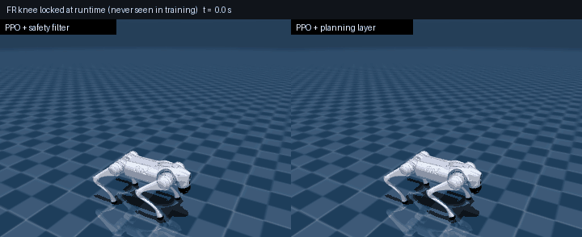
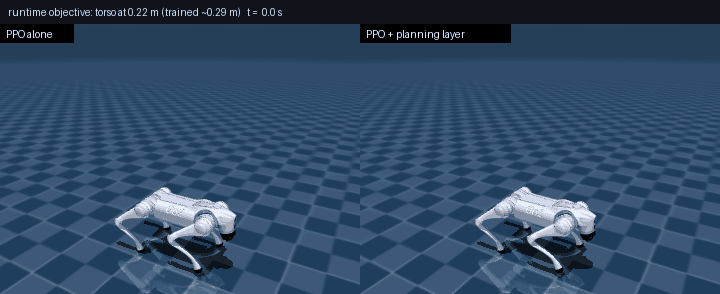
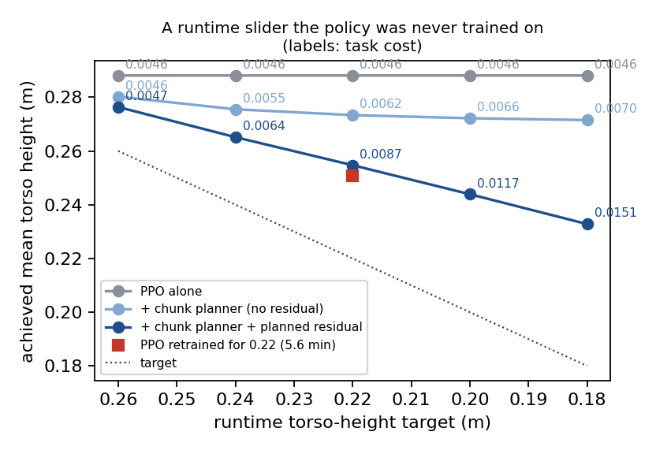

# 연구 방향: 학습된 보행 정책을 재학습 없이 실행 중에 맞춘다

2026-09-27. `docs/research_direction_ko.md`의 결론 — Go2 보행에서는 RL(PPO + gait
시계)이 DIAL보다 7–10배 강한 최적화기이고, DIAL을 증류한 CSM은 품질·비용·제약
유연성 어디서도 RL을 이기지 못한다 — 에서 출발한다.

## 방향

CSM이 원래 풀려던 문제는 "**실행 중에 목적을 바꿀 수 있는 제어기**"다. 그 문제는
그대로 두고 **최적화기를 바꾼다.** 기본 행동은 RL 정책이 만들고, 학습 때 없던 목적·
제약만 얇은 계획층이 실행 중에 메운다.

계획층(`csm/policy_completed_mppi.py`)은 매 계획마다

1. 정책을 planner 모델에서 K=4 step 굴려 명목 chunk를 얻고,
2. 그 주변에서 chunk N=256개와 상수 행동 잔차 b를 뽑아(제약 대역으로 자름),
3. 각 후보를 "chunk 4 step + 이후 12 step은 `정책(s) + b`의 폐루프"로 모델에서
   굴려 **실행 중 목적**(과제 보상 − 새로 요청한 비용)으로 채점하고,
4. softmax 가중 chunk의 행동을 실행한다(2 step마다 재계획, 계획 한 번에 40 ms까지 허용).

이론적 위치: 기본 정책을 base policy로 하는 Bertsekas rollout 알고리즘의 샘플링
판이다. 명목 chunk가 항상 후보에 있으므로, 모델 안에서는 선택된 계획이 실행 중
목적 기준으로 기본 정책보다 나빠지지 않는다(softmax가 argmin으로 날카로워질수록
정확히). 새로운 것은 방법 자체가 아니라(선행: Residual-MPPI, LOOP, TD-MPC) 아래
세 측정이다.

- **왜 적은 샘플로 되나** (`csm/smoothness_probe.py`): 정책이 지평선을 폐루프로
  완성하면 비용 지형이 개루프보다 훨씬 잘 조건화된다 — 비매끄러운 잔차 0.08 대
  1.13 logit, 2049-샘플 cloud의 ESS 0.87 대 0.19.
- **chunk는 짧아야 한다** (아래 ablation): 무릎 고정에서 K=4는 0/6 붕괴, K=8과
  K=16(지평선 전체를 개루프로 샘플, Residual-MPPI식)은 6/6 붕괴.
- **지속되는 목적에는 잔차가 필요하다**: chunk만으로는 완성 구간에서 정책이 자기
  스타일로 돌아가 "더 낮게 걷기" 같은 목적에 권한이 거의 없다(몸통 0.288 → 0.273).
  완성 구간에 계획된 상수 잔차를 실으면 재학습한 정책과 같은 수준에 도달한다
  (0.255 대 재학습 0.251).

## 결과

기본 정책: `csm_runs/rl-sweep-clock/uniform/policy.pkl`(PPO + 시계, 5천만 step,
4분). uniform weight, box_fast/box_turn × 3 seed, 1500 step(30초). 각 칸은
**과제 비용 / 새 목적의 지표**, 괄호는 붕괴 수. 과제 비용은 정책이 학습된 원래
목적만으로 잰 값이다(새 항은 포함하지 않는다). 지표: 제약·none은 몸통 높이(m),
`height`는 몸통 높이, `step`은 발 최고점 95백분위(m), `energy`는 Σ토크².

| 실행 중 목적 | 정책만 | **+ 계획층** (chunk + 잔차 σ=0.02) | 그 목적으로 재학습한 PPO |
|---|---|---|---|
| `none` | 0.0046 / 0.288 | 0.0035 / 0.296 | 0.0032 (제약 족으로 학습한 PPO, 200M) |
| `band:knee` | 0.0112 / 0.291 | 0.0041 / 0.298 | 0.0041 (제약 족으로 학습한 PPO, 200M) |
| `band:front` | 0.0152 / 0.292 | 0.0044 / 0.299 | 0.0047 (제약 족으로 학습한 PPO, 200M) |
| `band:crouch` | 0.0288 / 0.239 | 0.0166 / 0.239 | 0.0239 (제약 족으로 학습한 PPO, 200M) |
| `band:lock` | 5.3443 / -0.243 (6/6 붕괴) | 0.0257 / 0.263 | 0.0081 (제약 족으로 학습한 PPO, 200M) |
| `height:0.22:4` | 0.0046 / 0.288 | 0.0087 / 0.255 | 0.0101 / 0.251 |
| `step:0.14:0.05` | 0.0046 / 0.0834 | 0.0043 / 0.0868 | 0.0052 / 0.0899 |
| `energy:0.02` | 0.0046 / 473 | 0.0040 / 442 | 0.0042 / 376 |

재학습 열: `height`·`step`·`energy`는 그 항을 보상에 넣고 같은 레시피(5천만 step,
5–6분)로 다시 학습한 PPO. 대역 제약과 `none`은 `csm/constraint_compose.py`의
band-PPO — 단일 관절 한쪽 경계 족을 경계를 관측하며 2억 step 학습한 정책 — 로,
제약을 미리 알았을 때의 상한이다.

**설계 ablation.** 잔차 완성의 크기(σ_b, 계획마다 잔차가 움직이는 폭):

| 잔차 완성 σ_b | `none` | `band:knee` | `band:front` | `band:crouch` | `band:lock` | `height:0.22:4` | `step:0.14:0.05` | `energy:0.02` |
|---|---|---|---|---|---|---|---|---|
| 0 (chunk만) | 0.0037 / 0.292 | 0.0063 / 0.296 | 0.0080 / 0.299 | 0.0205 / 0.243 | 0.0399 / 0.272 | 0.0062 / 0.273 | 0.0042 / 0.0865 | 0.0040 / 450 |
| 0.02 | 0.0035 / 0.296 | 0.0041 / 0.298 | 0.0044 / 0.299 | 0.0166 / 0.239 | 0.0257 / 0.263 | 0.0087 / 0.255 | 0.0043 / 0.0868 | 0.0040 / 442 |
| 0.05 | 0.0036 / 0.296 | — | — | — | 0.9970 / 0.16 (2/6 붕괴) | 0.0093 / 0.252 | 0.0045 / 0.0871 | 0.0043 / 448 |

chunk 길이(잔차 없음). K=16은 지평선 전체를 정책의 명목 행동 주변에서 개루프로 샘플하는
것으로, Residual-MPPI식 잔차 샘플링(사전 log-likelihood 항 없음)에 해당한다:

| chunk K (잔차 없음) | `none` | `band:lock` | `height:0.22:4` | `step:0.14:0.05` |
|---|---|---|---|---|
| 16 (개루프 잔차) | 0.0045 / 0.288 | 4.9469 / -0.211 (6/6 붕괴) | 0.0047 / 0.285 | 0.0045 / 0.084 |
| 8 | 0.0042 / 0.289 | 3.2153 / -0.0423 (6/6 붕괴) | 0.0057 / 0.279 | 0.0043 / 0.0849 |
| 4 (기본) | 0.0037 / 0.292 | 0.0399 / 0.272 | 0.0062 / 0.273 | 0.0042 / 0.0865 |

**실행 중 항의 조합:**

| 조합 | 정책만 | + chunk 계획 | + 계획층 (잔차 0.02) |
|---|---|---|---|
| `band:lock+height:0.22:4` | 5.3442 / -0.243 (6/6 붕괴) | 0.0388 / 0.269 | 1.2576 / 0.132 (3/6 붕괴) |
| `band:knee+step:0.14:0.05` | 0.0112 / 0.0831 | 0.0066 / 0.0879 | 0.0051 / 0.0878 |

- **학습에 없던 제약**: 무릎 고정은 필터만 쓴 정책이 6/6 뒤집히는데 계획층은 0/6으로
  걷는다. 나머지 대역 제약에서 필터보다 과제 비용이 42–71% 낮고, **제약 족으로 2억
  step 학습한 band-PPO와 비기거나(knee 0.0041 = 0.0041) 이긴다**(front 0.0044 대
  0.0047, crouch 0.0166 대 0.0239). 고정에서만 band-PPO가 3배 싸다(0.0081 대 0.0257).
- **제약 없는 원래 과제에서도** 정책보다 24% 낫다(0.0035 대 0.0046) — rollout의
  개선 성질 그대로다.
- **지속되는 스타일 목적**(더 낮게 걷기): 0.22 m 목표에서 몸통 0.255 m, 그 목적으로
  5.6분 재학습한 PPO는 0.251 m — 재학습 없이 거의 같은 자리이고 과제 비용은 오히려
  낮다(0.0087 대 0.0101). 슬라이더를 0.26 → 0.18로 옮기면 몸통이 0.276 → 0.233으로
  연속적으로 따라간다.
- **약한 곳**: `step`(발을 더 높이)과 `energy`는 재학습 쪽이 확실히 낫다(발 최고점
  0.087 대 0.090, 토크² 442 대 376). 정책의 보행 리듬 자체를 바꿔야 하는 목적은
  4-step chunk와 상수 잔차로는 권한이 부족하다.
- **조합**: 무릎 대역 + 발 높이는 둘 다 지킨다. 무릎 고정 + 더 낮게 걷기는 잔차 없는
  chunk 계획으로는 0/6 붕괴로 둘 다 지키지만(몸통 0.269), 잔차를 켜면 3/6 붕괴한다 —
  몸을 낮추는 잔차가 고정된 무릎과 부딪힌다. 잔차의 크기를 제약에 따라 조절하는 것이
  남은 문제다.



왼쪽: 필터만 쓴 PPO — 넘어져 몸통이 바닥 아래로 빠진다(이 plant는 몸통–바닥 충돌이
없고 발만 충돌한다). 오른쪽: 같은 정책 + 계획층.





**계산 시간**(유휴 GPU, 1500 step 평균): 계획 한 번 약 27 ms(N=256, K=4, H=16,
10 ms 물리 substep). 매 step 계획하면 제어 주기 20 ms를 1.4배 넘고, **2 step마다 계획**
(계획 한 번에 40 ms 허용, 위 결과 전부의 설정)이면 제어 step당 15.4 ms로 실시간이다.
샘플 수를 128로 줄여도 시간은 같다(28.3 ms) — 비용은 샘플이 아니라 순차 깊이(16+4
step × 2 substep)에 있다. 계획 모델의 substep을 20 ms로 거칠게 하면 15.6 ms가 되지만
이득이 사라진다(제약 없는 과제 0.0052 대 정책 0.0046).

## 이 방향에서 주장할 것

1. **실행 중 맞춤의 조건**: 짧은 chunk + 정책 폐루프 완성 + 계획된 잔차. 셋 중
   하나가 빠지면 무엇이 무너지는지(개루프 → 조건화, 긴 chunk → 고정 붕괴, 잔차 없음
   → 지속 목적 권한 없음)를 측정으로 보인다.
2. **개선 보장**: 기본 정책 대비 실행 중 목적에서 나빠지지 않는다(모델 안에서) —
   Diffusion-MPC식 guidance(학습 데이터 분포를 기울임)에는 없는 성질.
3. **재학습 대비 위치**: 어떤 목적은 재학습과 같은 자리(대역 제약, 몸통 높이), 어떤
   목적은 못 미친다(발 높이, 에너지, 무릎 고정의 비용). 그 경계를 정책의 "권한"으로 설명하는 것이
   다음 이론 작업이다.

## 다음 실험

- **권한의 경계**: 정책 리듬을 바꾸는 목적(발 높이, 에너지)에서 무엇이 부족한가 —
  잔차를 상수 대신 위상의 함수로(gait 시계에 동기화된 잔차), chunk 길이와 잔차의
  역할 분담.
- **실시간**: 지금은 2 step마다 재계획(계획 한 번 ≤ 40 ms). 명목 chunk 재사용과
  학습된 끝값으로 순차 깊이를 줄여 매 step 계획으로.
- **모델 불일치**: 계획 모델을 거칠게(10 ms → 20 ms substep) 하면 이득이 사라졌다
  (제약 없는 과제 0.0052 대 정책 0.0046). 실제 로봇에서 계획 모델 오차가 얼마나
  허용되는지가 하드웨어로 가기 전 관문이다.
- **다른 과제**: 외란 극복(밀림 방향별 제약), 보행 스타일(gait 전환을 실행 중 목적으로).

## 재현

```bash
# 기본 정책(시계 sweep의 uniform)
csm_runs/rl_sweep_clock.sh
# 정책만 / 계획층
python -m csm.policy_completed_mppi --arm policy csm_runs/rl-sweep-clock/uniform/policy.pkl \
  --objectives none band:knee band:front band:crouch band:lock height:0.22:4 step:0.14:0.05 energy:0.02 \
  --out csm_runs/runtime_custom.json
python -m csm.policy_completed_mppi --replan-every 2 --residual-sigma 0.02 \
  --arm pc-res02 csm_runs/rl-sweep-clock/uniform/policy.pkl --objectives <같은 목록> \
  --out csm_runs/runtime_residual02.json
# 재학습 기준, ablation, 슬라이더, 조합
csm_runs/runtime_retrain.sh ; csm_runs/runtime_ablation.sh ; csm_runs/runtime_frontier.sh
# 표·그림, 클립
python -m csm.runtime_custom_report
python -m csm.render_runtime_custom --objective band:lock --residual-sigma 0.02 --out docs/assets/runtime_lock.gif
python -m csm.render_runtime_custom --objective height:0.22:4 --residual-sigma 0.02 --out docs/assets/runtime_height.gif
```
