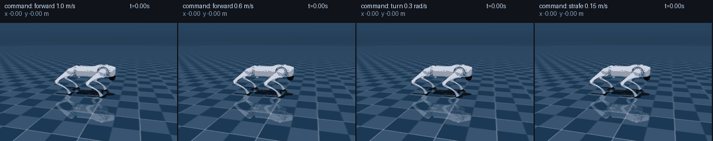
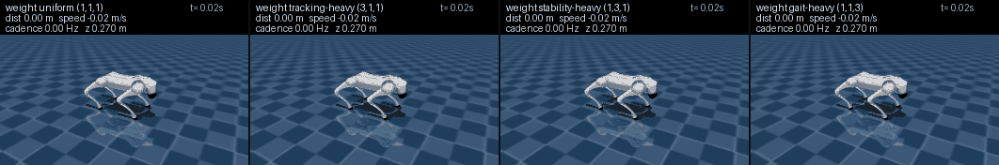
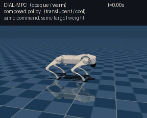

# 보행 task에서의 preference weight 합성: 실패한 첫 시도와, 되게 만든 두 번째 시도

## 요약

네 발 로봇(Unitree Go2)이 주어진 속도 명령을 따라 걷는 문제에서, 사용자가
preference weight를 바꾸면 걸음걸이가 달라지는 컨트롤러를 만들려 했다. 접근은
[외란 회복 보고서](push_recovery_report_ko.md)와 동일하다 — 몇 개의 basis weight에서
score network를 학습해 두고, 임의의 weight에서의 컨트롤러를 그 선형 결합으로 만든다.

**시도는 두 번이었고 결과가 정반대다.**

**첫 시도는 실패했다.** 세 network를 섞은 결과가 여섯 개 목표 weight에서 평균 성능
비율 1.49~2.18인 반면, **network 하나만 그대로 쓴 것이 1.11**이었다. 합성한
컨트롤러보다 합성하지 않은 컨트롤러가 나았다. 원인은 학습이나 합성 수식이 아니라
**reference 컨트롤러 자체가 weight에 따라 거의 같은 걸음을 만들고 있었던 것**이다.
weight가 바꿀 것이 애초에 없었다.

**두 번째 시도는 작동한다.** 같은 세 항목, 같은 로봇, 같은 합성 수식이다. 바뀐 것은
목적함수를 sample에 반영하는 방식(§3)과 명령을 고정하지 않은 것(§3.5), 그리고
학습 범위를 어디까지 열 것인가라는 설계 선택(§6)이다.

| 목표 weight 8개 × 명령 4개 × seed 2회 | 값 |
|---|---|
| DIAL 대비 비용 비율 (중앙값) | **1.253** |
| 비율 (평균) | 1.375 |
| 비율 (최악) | 2.881 |
| **낙상** | **0 / 64** |
| DIAL 낙상 | 0 / 64 |

그리고 첫 시도에서 "구분되지 않는다"고 기록했던 바로 그 그림이 이번에는 갈라진다.
같은 명령에서 weight만 바꿨을 때 3초간 전진 거리가 첫 시도에서는 **2.8%** 안에
모였고(§2.4), 이번에는 **17.1%** 벌어진다(§7.2).

이 문서는 첫 시도의 진단(§2), 그로부터 무엇을 바꿨는지(§3), 바꾼 것이 실제로
효과가 있는지 학습 전에 확인한 결과(§4), 명령 범위를 둘러싼 실패와 회복(§5~6),
그리고 최종 결과(§7)를 기록한다.

---

## 1. 이론적 배경

### 1.1 문제 설정

로봇은 주어진 속도 명령 $(v_x, v_y, \omega_z)$ 를 따라 걷는다. 컨트롤러는 12개
관절의 목표 토크를 50 Hz로 내보낸다. 평가 항목은 세 가지다.

| 이름 | 측정 대상 |
|---|---|
| **tracking** | 몸통 속도와 회전 속도가 명령값과 얼마나 다른가 |
| **stability** | 몸통이 얼마나 기울었는가 + 방향이 얼마나 틀어졌는가 + 높이가 얼마나 벗어났는가 |
| **gait** | 네 발의 높이가 정해진 trot 궤적에서 얼마나 벗어났는가 |

세 항목을 벡터 $C(x) \in \mathbb{R}^3$ 로 두고 weight $\omega \in \mathbb{R}^3$ 와
내적해 스칼라 목적함수를 만든다.

$$R(x;\ \omega) = \omega \cdot C(x)$$

행 정규화 계수를 모두 1로 두면 $\omega = (1,1,1)$ 이 원래의 trot 보상을 정확히
재현한다. 두 번째 시도에서 이 계수를 조정했으며(§3.2) 그때도 이 성질은 유지된다.

### 1.2 Reference 컨트롤러와 학습 목표

기준 컨트롤러는 sampling 기반 model predictive controller(DIAL-MPC)다. 매 제어
스텝마다 현재 계획 주변에 Gaussian noise를 뿌려 2048개 변형을 만들고, 각각을 물리
시뮬레이터로 굴려 점수를 매긴 뒤, softmax 가중 평균으로 계획을 갱신한다.

이 갱신은 다음 Gibbs distribution의 **score**(로그 확률의 gradient)를 유한 sample로
추정하는 것과 같다.

$$p(U;\ \omega) \propto \exp\!\left(\frac{\omega \cdot C(U)}{T}\right)
\qquad\Longrightarrow\qquad
\nabla_U \log p = \frac{1}{T}\sum_{i=1}^{3} \omega_i\, \nabla_U C_i(U)$$

**score는 weight에 대해 linear다.** $\nabla_U C_i$ 세 개는 weight와 무관하게 고정된
대상이고, weight는 그것들을 섞는 계수일 뿐이다. 따라서 세 개의 weight에서 score를
network로 배워 두면 임의의 weight에서의 score를 선형 결합으로 만들 수 있다 — 이것이
이 접근 전체의 근거다.

### 1.3 합성 계수

basis weight $\{\omega_1, \omega_2, \omega_3\}$ 를 행으로 쌓은 행렬을 $B$ 라 하면,
목표 $\omega^*$ 에 대한 계수는 pseudoinverse로 얻는다.

$$a = \omega^{*\top} B^{+}, \qquad
\Delta_{\text{composed}} = \sum_i a_i\, \Delta_i$$

**basis 개수가 항목 개수를 넘으면 이 식이 무너진다.** $B$ 가 full row rank일 때만
$\omega^* = \omega_j$ 에 대해 $a = e_j$ 가 나온다. 항목이 3개인데 basis를 4개 쓰면
rank가 3에 묶이고, pseudoinverse는 최소 norm 해를 돌려주면서 계수가 0이어야 할
network들을 섞어 넣는다. 실측으로 확인된다.

| basis 개수 | 항목 개수 | basis 자신 재현 오차 |
|---|---|---|
| 3 | 3 | $8.3\times10^{-7}$ |
| 3 | 3 | $4.8\times10^{-7}$ |
| **4** | 3 | **2.00** (그리고 나머지 행 0.47~0.68) |

두 번째 시도의 최종 모델에서도 이 검사는 정확히 통과한다 — 목표를 basis 자신으로
두면 계수가 $[1,0,0]$, $[0,1,0]$, $[0,0,1]$ 로 나온다.

---

## 2. 첫 시도: 합성이 이득을 주지 못했다

첫 시도의 설정은 **명령을 0.8 m/s 직진으로 고정**하고, sample 점수를 그 자신의
표준편차로 나누는 DIAL의 기본 구현을 그대로 따른 것이었다.

### 2.1 개별 network는 잘 학습되었다

네 개의 basis weight에서 각각 network를 학습했다.

| network | weight | 학습 데이터 | 검증 상대 오차 | cosine | label 자체 noise |
|---|---|---|---|---|---|
| A | (1,1,1) | 163,296 | **0.086** | 0.989 | 3.3% |
| B | (3,1,1) | 177,120 | 0.093 | 0.987 | 3.7% |
| C | (1,3,1) | 176,040 | **0.084** | 0.989 | 3.3% |
| D | (1,1,3) | 296,208 | 0.086 | 0.988 | 3.1% |

**cosine similarity 0.987~0.989는 매우 높은 값이다.** 학습 자체는 잘 되었다. weight를
하나로 고정하고 1,000 스텝(20초)을 굴리면 network A는 낙상 0회로 걷는다.

### 2.2 그런데 합성은 손해였다

**핵심은 대조군이다.** 합성한 결과를 reference와만 비교하면 "합성이 도움이 되는가"를
알 수 없다. **network 하나만 그대로 쓰는 것**을 함께 재야 한다.

| 구성 | (1,1,1) | (2,1,1) | (1,2,1) | (1,1,2) | (2,2,1) | (5,5,3) | 평균 | 낙상 |
|---|---|---|---|---|---|---|---|---|
| 합성 A: (1,1,1)+(3,1,1)+(1,3,1) | 1.16 | 1.70 | 2.05 | 2.31 | 2.44 | 3.41 | **2.18** | 23 |
| 합성 B: (1,1,1)+(3,1,1)+(1,1,3) | 1.13 | 1.68 | 2.39 | 1.57 | 1.12 | 1.06 | **1.49** | 11 |
| 합성 C: 네 개 전부 (rank 부족) | 1.72 | 2.10 | 1.69 | 1.69 | 2.48 | 2.79 | **2.08** | 19 |
| **단일 network A (1,1,1)** | 1.15 | **0.94** | 1.19 | 1.25 | 1.04 | 1.06 | **1.11** | **0** |
| 단일 network C (1,3,1) | 1.34 | 1.15 | 1.37 | 1.47 | 1.27 | 1.25 | 1.31 | 18 |
| 단일 network D (1,1,3) | 1.91 | 1.74 | 2.09 | 2.03 | 1.91 | 1.96 | 1.94 | 18 |
| 단일 network B (3,1,1) | 2.40 | 1.99 | 2.57 | 2.64 | 2.24 | 2.30 | 2.36 | 7 |

**단일 network A가 모든 합성 구성보다 낫다.** 평균 1.11 대 1.49~2.18, 낙상 0회 대
11~23회. 게다가 그 network는 목표 weight를 **무시하고** 있는데도 그렇다.

이것이 첫 시도의 핵심 결과다. **합성이 실패한 것이 아니라, 합성할 가치가 없었다.**

### 2.3 원인: reference 컨트롤러부터 weight에 반응하지 않았다

network를 빼고 **reference 컨트롤러만으로** 확인할 수 있다. 여섯 개 weight 각각으로
컨트롤러를 굴려 궤적을 얻은 뒤, 그 궤적들을 **모든 weight의 목적함수로 교차 채점**
한다. weight가 의미가 있다면 각 목적함수는 자기 weight로 만들어진 궤적을 가장 높게
평가해야 한다 — 즉 대각 성분이 이겨야 한다.

| 궤적을 만든 weight ↓ / 채점 weight → | (1,1,1) | (2,1,1) | (1,2,1) | (1,1,2) | (2,2,1) | (5,5,3) |
|---|---|---|---|---|---|---|
| (1,1,1) | −0.2224 | −0.2569 | −0.2302 | −0.4023 | −0.2648 | −0.7519 |
| (2,1,1) | −0.2137 | **−0.2335** | −0.2220 | −0.3993 | −0.2418 | −0.6973 |
| (1,2,1) | −0.2277 | −0.2627 | −0.2382 | −0.4099 | −0.2732 | −0.7741 |
| (1,1,2) | **−0.2105** | −0.2670 | **−0.2160** | **−0.3589** | −0.2725 | −0.7556 |
| (2,2,1) | −0.2180 | −0.2397 | −0.2275 | −0.4047 | **−0.2492** | −0.7164 |
| (5,5,3) | −0.2192 | −0.2429 | −0.2280 | −0.4058 | −0.2518 | −0.7227 |

**대각이 6개 중 2개에서만 이긴다.** 같은 weight로 seed만 바꿔 만든 대조표의 변동폭이
약 1%였으므로, 위의 3~9% 격차는 잡음이 아니다.

### 2.4 눈으로도 구분되지 않았다

3초 동안의 정량값도 마찬가지다.

| weight | 전진 거리 | 횡방향 이탈 | 평균 몸통 높이 | 높이 변동 |
|---|---|---|---|---|
| (1,1,1) | 1.970 m | 0.018 m | 0.291 m | 0.0107 |
| (2,1,1) | 1.984 m | 0.004 m | 0.291 m | 0.0090 |
| (1,2,1) | 1.964 m | 0.008 m | 0.293 m | 0.0104 |
| (1,1,2) | 1.929 m | 0.040 m | 0.279 m | 0.0109 |

전진 거리가 1.929~1.984 m로 **2.8% 안에 모여 있다.** 두 weight를 겹쳐 보면 더
분명하다.

선명하고 따뜻한 색이 $(1,1,1)$, 반투명하고 차가운 색이 $(1,1,2)$ 다. **두 로봇이
거의 완전히 겹쳐서 하나로 보인다.**

### 2.5 당시의 결론과, 그것이 부분적으로만 옳았다는 것

당시 내린 진단은 이랬다. 세 항목이 **모두 같은 하나의 nominal trot 궤적으로부터의
편차에 대한 penalty**이므로 동시에 최소가 되고, 따라서 어떤 weight를 주든 최적해가
그 한 점으로 같다는 것이다.

$$\text{모든 } i \text{ 에 대해 } \arg\min_x C_i(x) = x_{\text{trot}}
\quad\Longrightarrow\quad
\arg\min_x\ \omega \cdot C(x) = x_{\text{trot}} \quad \forall\, \omega > 0$$

**이 논증은 nominal에 도달할 수 있을 때만 성립한다.** 그리고 그것이 첫 시도가
측정한 조건이었다 — 0.8 m/s 직진은 이 로봇에게 쉬운 과제여서 세 항목을 거의 동시에
만족시킬 수 있었다. nominal이 **도달 불가능**해지면 세 항목은 서로 다른 잔차를
요구하기 시작하고, 그때 weight는 **어느 잔차를 감수할 것인가**를 결정한다. 이것이
두 번째 시도에서 실제로 일어난 일이다(§4.2).

첫 시도가 놓친 것이 하나 더 있다. 그 논증은 **최적해**에 대한 것인데, sampling
컨트롤러가 실제로 하는 일은 최적해를 찾는 것이 아니라 **유한한 sample cloud를
가중 평균하는 것**이다. 가중이 충분히 날카롭지 않으면 weight가 무엇이든 cloud의
평균이 나오고, 그것은 최적해의 성질과 무관하게 weight를 무력화한다. 첫 시도의
온도 설정이 정확히 그 영역에 있었다(§3.1).

---

## 3. 두 번째 시도: 무엇을 바꿨는가

로봇도, 세 항목의 정의도, 합성 수식도 그대로다. 바꾼 것은 다섯 가지이며, 전부
[외란 회복 task](push_recovery_report_ko.md)에서 먼저 검증된 것들이다.

### 3.1 표준편차 나눗셈을 없애고 온도를 낮췄다 (raw Gibbs)

DIAL의 기본 구현은 sample 점수를 그 cloud의 표준편차로 나눈 뒤 softmax에 넣는다.
그 나눗셈은 갱신을 **weight의 크기와 온도에 무관**하게 만든다. §1.2의 유도에서
score가 $\omega/T$ 에 linear라고 했는데, 나눗셈은 바로 그 비례 관계를 지운다.
첫 시도가 $(1,1,1)$ 목표에서 방향은 cosine 0.9997로 맞히면서 크기를 40% 틀린
이유가 이것이다.

두 번째 시도는 나눗셈을 제거하고 온도를 명시적으로 다룬다. 그러자 온도가 **판별력을
직접 지배**하는 것이 보인다. 같은 목적함수, 같은 sample cloud에서 온도만 바꿔
교차 채점 대각 승리를 세면:

| 온도 | 0.003 | 0.006 | **0.015** | 0.030 | 0.060 |
|---|---|---|---|---|---|
| 대각 승리 (7개 중) | 6 | 5 | **6** | 5 | **3** |
| 유효 sample 수 (2049개 중) | 0.2~4.5% | 1.2~14.4% | **23.7~44.2%** | 55.6~69.7% | 80.2~87.2% |

**온도가 높으면 weight가 무력해진다.** 0.060에서는 대각이 7개 중 3개로 떨어진다.
첫 시도는 reference 0.05 / 수집 0.3에서 돌았고, 거기에 표준편차 나눗셈까지 있었다.
§2.3의 "대각 6개 중 2개"는 목적함수만의 성질이 아니라 **목적함수와 sampler 설정의
곱**이었던 셈이다.

반대로 온도가 너무 낮으면 유효 sample이 몇 개로 줄어 갱신이 난수에 좌우된다.
0.015는 대각 승리가 최대이면서 유효 sample이 4분의 1 이상 남는 지점이다.

### 3.2 세 항목의 크기를 맞췄다

weight가 의미를 가지려면 세 항목이 **비슷한 크기로 sample cloud를 흔들어야** 한다.
한 항목의 변동폭이 다른 것의 10배면 weight를 아무리 조정해도 그 항목이 항상 이긴다.

cloud 위에서 각 항목의 표준편차를 재고, 그것을 균등하게 만드는 나눗수를 도입했다
(전체 크기는 기하평균으로 보존하므로 $\omega=(1,1,1)$ 의 의미는 유지된다).

| 항목 | 나눗수 | 좁힌 명령 범위에서 재측정한 산포 |
|---|---|---|
| tracking | 1.211 | 0.04052 |
| stability | 0.424 | 0.03762 |
| gait | 1.946 | 0.03572 |

**최대/최소 1.1배.** 세 항목이 같은 크기로 cloud를 흔든다.

### 3.3 $\nu = \omega/T$ 공간에서 합성한다

나눗셈을 없애면 갱신의 크기가 $\omega/T$ 에 정직하게 비례하므로, 계수를 그 공간에서
풀 수 있다.

$$a = \frac{1}{T^*}\,\hat\omega^{*\top} B_\nu^{+}$$

첫 시도에서 크기 오차를 메우려고 넣었던 "계수의 합을 1로" 보정이 필요 없어진다.

### 3.4 어닐링 레벨마다 온도를 따로 준다

DIAL은 거친 레벨에서 고운 레벨로 두 번에 걸쳐 계획을 다듬는다. 두 레벨의 **리턴
산포가 다르다** — 거친 레벨의 sample은 훨씬 넓게 퍼진다. 하나의 온도로 둘을 다
돌리면 거친 레벨의 softmax가 사실상 균등해져서, 10분의 1이 넘어지는 cloud의
평균을 갱신으로 쓰게 된다.

| weight | 거친 레벨 산포 | 고운 레벨 산포 | 비 |
|---|---|---|---|
| uniform | 0.2300 | 0.0475 | 4.84 |
| boost0 | 0.1533 | 0.0408 | 3.76 |
| boost1 | 0.2002 | 0.0437 | 4.58 |
| boost2 | 0.2651 | 0.0481 | 5.51 |

**`level_scales = [4.671, 1.0]`.** 이 보정을 빠뜨렸을 때 평가에서 DIAL이 16
에피소드 전부 넘어졌다 — 학생이 교사보다 잘 걷는 결과가 나왔고, 그것은 합성에
대한 결과가 전혀 아니었다.

### 3.5 명령을 고정하지 않았다 — 충돌의 원천

가장 중요한 변경이다. 첫 시도는 0.8 m/s 직진 하나만 다뤘고, §2.5에서 적었듯 그
조건에서는 세 항목이 동시에 만족된다.

두 번째 시도는 매 에피소드 안에서도 50 스텝마다 명령을 다시 뽑는다. 그러면 로봇은
빠른 전진, 선회, 횡이동을 오가야 하고 **nominal trot 궤적에 도달할 수 없는 구간이
생긴다.** 그 구간에서 세 항목은 서로 다른 것을 요구한다 — 명령 속도를 맞추려면
발을 빨리 놀려야 하고, 그러면 몸통이 흔들리고, 발 궤적은 nominal에서 벗어난다.
**weight가 결정할 것이 생긴다.**

---

## 4. 학습 전 검사: weight가 실제로 걸음을 바꾸는가

첫 시도의 가장 큰 교훈은 **"학습을 시작하기 전에 reference 컨트롤러만으로 weight의
판별력을 측정하라"** 였다. 이번에는 그것을 먼저 했다.

### 4.1 같은 sample cloud를 여러 weight로 재가중한다

DIAL을 공통 weight로 예열해 sample cloud를 하나 뽑고, 그 **동일한 cloud**를 모든
weight로 재가중해 비교한다. sample을 공유하므로 "각 weight가 방문한 상태의 난이도"가
섞이지 않는다.

| 지표 | 값 |
|---|---|
| 교차 채점 대각 승리 | **6 / 7** |
| 유효 sample 수 | 23.7 ~ 44.2% |
| 낙상률 (학습 범위 안) | 0.003 ~ 0.014 |

가장 결정적인 것은 **상위 sample 집합의 중첩**이다. 순수 basis 방향 $e_0, e_1, e_2$
끼리 상위 2%가 겹치는 비율이 **0.005 ~ 0.014** 로, 우연 수준(0.010)과 같다.

| | $e_0$ | $e_1$ | $e_2$ |
|---|---|---|---|
| $e_0$ | 1.000 | 0.006 | 0.005 |
| $e_1$ | 0.006 | 1.000 | 0.014 |
| $e_2$ | 0.005 | 0.014 | 1.000 |

**세 항목이 같은 cloud에서 완전히 다른 sample을 고른다.** §2.3의 표와 정확히
대비되는 결과다.

유일한 미달은 stability를 강조한 weight로, uniform에게 **−0.79%** 로 근소하게 진다.
이 항목은 이후 학습과 실행에서도 반복해서 가장 약한 고리로 나타난다(§7.3).

### 4.2 물리적 거동은 더 분명하게 갈린다

점수는 시시한 이유로도 달라질 수 있으므로, 각 weight로 실제 DIAL 루프를 돌려
걸음걸이를 직접 쟀다. **weight를 바꿨을 때의 차이를 seed만 바꿨을 때의 변동으로
나눈 값**이 판정 기준이다.

| 명령 | 속도 | duty factor | 보폭 빈도 | 몸통 진동 | 착지 속도 |
|---|---|---|---|---|---|
| 전진 1.0 | **38×** | 27× | 27× | 15× | 14× |
| 전진 0.6 | 38× | 28× | 27× | 14× | 12× |
| 선회 0.3 | **42×** | 25× | 18× | 12× | 13× |
| 횡이동 0.15 | **43×** | 29× | 23× | 11× | 14× |

**모든 항목이 잡음의 11배 이상이다.** 그리고 방향이 물리적으로 말이 된다
(명령 1.0 m/s, DIAL, 200 스텝):

| weight | 전진 거리 | duty | 보폭 빈도 | 보폭 | **몸통 진동** | 착지 속도 |
|---|---|---|---|---|---|---|
| 균등 | 3.20 | 0.690 | 1.97 | 0.409 | 2.20 | 1.16 |
| **추종 강조** | 3.11 | 0.745 | **2.47** | 0.318 | **5.27** | 0.82 |
| **안정 강조** | **2.83** | 0.729 | **1.75** | 0.407 | 2.81 | 1.05 |
| **보행 강조** | 3.04 | **0.683** | 1.91 | 0.403 | **1.73** | **1.21** |

**추종을 키우면 잔발질을 한다** — 보폭 빈도가 가장 높고 보폭이 가장 짧으며, 그
대가로 몸통 진동이 균등의 2.4배다. 부드러움을 팔아 추종을 산다.

**보행을 키우면 정반대다** — 몸통 진동이 가장 낮고 duty가 가장 낮으며, 대신 발을
가장 세게 딛는다.

**안정을 키우면 가장 느리다** — 전진 거리 꼴찌, 보폭 빈도 최저. 속도를 팔아 안정을
산다.

§2.4의 표와 나란히 놓으면 대비가 분명하다: 첫 시도에서 네 weight의 전진 거리가
2.8% 안에 모였던 자리에, 이번에는 **13.1%** 가 벌어진다.

---

## 5. 명령 범위: 넓게 열었다가 실패했다

§3.5에서 명령을 무작위화한 것은 옳았지만, **얼마나 넓게** 열 것인가는 별도의
설계 선택이고 여기서 한 번 실패했다.

### 5.1 넓은 범위: 데이터를 두 배로 늘려도 무너졌다

전진 0.2~1.2, 횡 ±0.3, 선회 ±0.8으로 열고 82만 query(5.4시간)를 모았다. 수집
중 DIAL은 533 에피소드에서 2번 넘어졌다 — 컨트롤러 자체는 멀쩡했다.

그런데 학습된 컨트롤러는 **80 에피소드 중 42번 넘어졌다.** 평균 비용 비율 27.97.

DAgger(학습된 컨트롤러가 몰면서 데이터를 더 모으는 방법)로 고치려 하자 **더
나빠졌다.** 학습된 컨트롤러가 비틀거리는 상태에서는 DIAL의 label 자체가 불안정해진다.

| 라운드 | label 잡음 | 유효 sample | 검증 오차 |
|---|---|---|---|
| 1 (DIAL이 몲) | 12.6 ~ 14.2% | 23.5 ~ 27.6% | 0.184 ~ 0.242 |
| 2 (학습된 컨트롤러가 몲) | **25.8 ~ 36.5%** | **14.3 ~ 16.4%** | — |
| 1 + 2 합쳐 학습 | — | — | **0.396 ~ 0.532** |

라운드 2에서만 312번 넘어졌고, 두 라운드를 합쳐 학습하니 라운드 1만 쓴 것보다
검증 오차가 두 배가 됐다.

### 5.2 좁힌 범위: 같은 데이터 양으로 해결됐다

부피를 13분의 1로 줄였다. **데이터 양은 그대로 뒀다** — 예산까지 바꾸면 무엇이
효과였는지 알 수 없어지기 때문이다.

| | 이전 | 이후 |
|---|---|---|
| 전진 | 0.2 ~ 1.2 | **0.6 ~ 1.0** |
| 횡 | ±0.3 | **±0.15** |
| 선회 | ±0.8 | **±0.3** |

잘라낸 영역이 실제로 어려운 영역이었다. DIAL의 낙상률이 학습 범위 안에서는
0.003~0.014인데 잘라낸 1.2 m/s에서는 **0.049** 다. 같은 예산으로 수집한 데이터의
평균 보상도 −0.123에서 **−0.070** 으로 좋아졌다.

결과는 극적이다.

| | 넓은 범위 (82만) | **좁힌 범위 (82만)** |
|---|---|---|
| 평균 비용 비율 | 27.97 | **1.585** |
| **낙상** | **42 / 80** | **0 / 64** |

### 5.3 놀라운 점: 회귀 오차는 바뀌지 않았다

좁히면 데이터가 조밀해져 network가 더 정확해질 것이라고 예상했다. **그 예상은
틀렸다.**

| | 넓은 범위 | 좁힌 범위 |
|---|---|---|
| label 잡음 | 12.6 / 14.2 / 12.9% | 12.1 / 12.3 / 12.4% |
| **검증 오차** | 0.197 / 0.242 / 0.184 | **0.214 / 0.200 / 0.192** |
| 평균 | **0.208** | **0.202** |

label 품질은 의도대로 좋아졌지만 **회귀 오차는 2.7%, 즉 측정 잡음 수준으로만
움직였다.** 그런데 실행 결과는 낙상 42회와 0회로 갈린다.

**같은 크기의 score 오차가 두 영역에서 전혀 다른 대가를 치른다.** 신경망은 매 순간
조금씩 틀리고 그 오차는 다음 순간의 계획에 다시 들어가 누적된다. 빠르게 달리거나
급선회하는 중이면 회복 여유가 없어 작은 오차가 낙상으로 이어지고, 천천히 걷는
중이면 흡수된다. DIAL의 낙상률 차이(0.049 대 0.003~0.014)가 이미 그것을 말하고
있었다.

**즉 좁히기는 network를 정확하게 만든 것이 아니라, 부정확해도 되는 영역으로 옮긴
것이다.** 병목은 데이터 밀도가 아니라 과제 난이도였다.

---

## 6. 용량

남은 결함은 하나였다 — 안정을 강조한 목표가 선회 명령에서 비율 6.98로 무너졌다.
데이터를 더 붓는 것은 §5.3의 결과로 근거가 약해졌으므로, **같은 데이터로 더 크게,
더 오래** 학습했다(512×3 / 12만 스텝 → 768×3 / 30만 스텝).

| 항목 | 확대 전 | 확대 후 | 개선 |
|---|---|---|---|
| tracking | 0.2139 | 0.1944 | 9% |
| stability | 0.1996 | **0.1784** | 11% |
| gait | 0.1925 | **0.1737** | 10% |
| **평균** | 0.2020 | **0.1822** | **10%** |

**세 항목이 나란히 비슷한 폭으로 좋아졌다.** 특정 항목만 용량에 굶주려 있던 것이
아니다. 검증 오차 10% 개선이 최악 비율을 2.4배 낮췄다(6.98 → 2.88).

여전히 명령을 고정했을 때의 0.156보다는 위이고, label 잡음이 만드는 바닥값 0.122
보다도 위다. 폭 1.5배와 반복 2.5배로 10%를 얻었으므로 **수익이 빠르게 줄어드는
구간**이다.

---

## 7. 결과

최종 모델은 좁힌 명령 범위에서 모은 82만 query로 학습한 768×3 network 세 개다.

### 7.1 명령을 따라 걷는다

왼쪽부터 전진 1.0 m/s, 전진 0.6 m/s, 선회 0.3 rad/s, 횡이동 0.15 m/s다. 네 경우
모두 목표 weight를 균등으로 두고 **같은 세 network를 섞어** 만든 컨트롤러이며,
명령만 바꿔 넣었다.

### 7.2 weight가 걸음을 바꾼다

같은 명령(전진 1.0 m/s), 같은 세 network, 목표 weight만 다르다. 왼쪽부터 균등,
추종 강조, 안정 강조, 보행 강조다. 3초 동안의 정량값은 다음과 같다.

| 목표 weight | 전진 거리 | 평균 몸통 높이 | **높이 변동** | 평균 비용 |
|---|---|---|---|---|
| 균등 | **2.201 m** | 0.263 | 0.0078 | 0.0411 |
| 추종 강조 | 2.063 m | 0.253 | **0.0149** | 0.0552 |
| 안정 강조 | **1.880 m** | **0.270** | 0.0089 | 0.0409 |
| 보행 강조 | 2.050 m | 0.252 | 0.0079 | 0.0441 |

**전진 거리가 1.880 ~ 2.201 m로 17.1% 벌어진다.** §2.4의 같은 표에서 2.8%였던
값이다. 높이 변동도 1.9배 차이가 나며(첫 시도에서는 1.2배), 안정을 강조하면 몸통을
가장 높고 고르게 유지하면서 가장 적게 나아간다 — §4.2에서 DIAL이 보인 경향과 같다.

**학습된 컨트롤러가 DIAL의 trade-off를 물려받았다는 것**이 이 표의 의미다.

### 7.3 DIAL과 나란히 놓으면

선명하고 따뜻한 색이 DIAL, 반투명하고 차가운 색이 합성된 컨트롤러다. 같은 명령,
같은 목표 weight, 같은 초기 상태다. 이 구간에서 비용 비율은 **1.279** 다.

**§2.4의 겹쳐 보기와 비교 대상이 다르다는 점에 주의해야 한다.** 그쪽은 서로 다른
두 weight를 겹친 것이어서 겹치는 것이 곧 실패였다. 여기는 같은 weight의 교사와
학생을 겹친 것이므로 **겹치는 것이 성공**이다. 두 로봇은 나란히 걷지만 위상이
조금씩 어긋나며, 그 어긋남이 비용의 28%에 해당한다.

전체 평가는 목표 weight 8개 × 명령 4개 × seed 2회, 즉 64 에피소드다.

| | 512×3 / 12만 | **768×3 / 30만** |
|---|---|---|
| 중앙값 비율 | 1.316 | **1.253** |
| 평균 비율 | 1.585 | 1.375 |
| **최악 비율** | 6.98 | **2.881** |
| 1.5배 이내 | 24 / 32 | **27 / 32** |
| **낙상** | 0 / 64 | **0 / 64** |

**32개 경우 전부가 2.9배 이내이고 한 번도 넘어지지 않는다.**

### 7.4 학습 범위 밖

학습하지 않은 명령 세 개(전진 1.2, 선회 0.8, 전진 0.5)에서도 재 봤다.

| 명령 | 중앙값 비율 | 낙상 |
|---|---|---|
| 전진 0.5 (하한 밖) | 1.31 | 0 / 16 |
| 전진 1.2 (상한 밖) | 1.40 | 0 / 16 |
| 선회 0.8 (2.7배 밖) | 1.96 | 2 / 16 |

**48 에피소드 중 2번만 넘어진다.** 넓은 범위로 학습한 컨트롤러는 **이 세 명령을
학습 범위 안에 두고도** 48번 중 28번 넘어졌다 — 좁게 배운 쪽이 자기가 배우지 않은
영역에서 더 잘 걷는다.

다만 용량 확대가 범위 밖에서는 도움이 되지 않았다. 중앙값은 1.412에서 1.368로
조금 좋아졌지만 **최악의 경우가 7.08에서 43.41로 나빠졌고** 낙상이 2회에서 4회로
늘었다. 학습 분포에 더 정확히 맞춰지면서 그 바깥에서의 외삽이 거칠어진 것으로,
**의도한 교환이지만 공짜는 아니었다.**

### 7.5 남은 약점

비율을 **안정 강조 목표와 나머지**로 가르면 하나의 결함이 전부를 설명한다.

| | 안정 강조 (8개) | 나머지 (24개) |
|---|---|---|
| 학습 범위 안 | 평균 2.38, 최대 6.98 | **평균 1.32, 최대 2.28** |
| 학습 범위 밖 | 평균 5.97, 최대 13.64 | **평균 1.49, 최대 2.22** |

(512×3 모델 기준. 768×3에서는 범위 안 최대가 2.88로 내려간다.)

**stability 항목의 score field가 셋 중 가장 배우기 어렵다.** 그리고 이 약점은 서로
독립적인 세 측정이 이미 각각 지목하고 있었다 — 사전 검사에서 유일하게 대각 승리를
놓쳤고(§4.1, −0.79%), 넓은 범위 학습에서 검증 오차가 가장 컸으며(0.2423), 실행에서
유일한 실패 지점이다. 우연이 아니다.

---

## 8. 진단 과정에서 확인한 측정 함정들

두 시도에 걸쳐, 잘못된 측정으로 여러 번 방향을 잘못 잡았다.

### 8.1 각 컨트롤러를 자기가 방문한 상태에서 채점하면 비교가 아니다

컨트롤러 A를 굴려 그 상태들에서 A의 정확도를 재고, B를 굴려 B의 정확도를 재면,
두 숫자는 **서로 다른 시험지**의 점수다. 실제로 DAgger 이후 $(1,3,1)$ network는
자기 상태에서 cosine이 0.650 → 0.693으로 좋아졌지만, 같은 시점에 $(1,1,1)$ 의
상태에서는 0.332 → 0.295로 나빠졌다.

§4.1의 검사가 **하나의 cloud를 공유해** 여러 weight를 비교하는 이유가 이것이다.

### 8.2 평가 구간이 결과를 뒤집는다

관절 한계 종료 조건이 의도치 않은 안전망 역할을 하고 있었다. 학습된 컨트롤러가
약 167 스텝마다 리셋되면서 학습 분포 근처에 머물렀고, 400 스텝 평가는 성능 비율
1.15로 좋게 나왔다. **같은 컨트롤러를 3,000 스텝으로 평가하면 1.74였다.**

### 8.3 낙상 시점에서 점수를 끊으면 넘어지는 쪽이 이긴다

비용을 첫 낙상까지만 평균하면, 10스텝에서 넘어진 컨트롤러를 **비용이 아직 쌓이기
전인 10스텝으로** 채점하게 된다. 초기 구현이 이것이었고, 넘어진 컨트롤러가 DIAL
보다 **좋게** 나왔다. 환경은 done 이후에도 계속 스텝을 밟으므로 전 구간 평균이
바닥에 누워 있는 것의 대가를 제대로 매긴다.

### 8.4 온도는 그것이 쓰일 방식으로 재야 한다

유효 sample 수 표를 표준편차 나눗셈이 켜진 상태로 계산해 놓고, 실제 수집은 raw
Gibbs로 돌린 적이 있다. **같은 온도가 두 방식에서 전혀 다른 날카로움을 만든다.**
그 실수로 0.3을 골랐는데, raw Gibbs에서 0.3은 유효 sample이 93~98%, 즉 거의 균등
평균이다. 판별력은 그보다 훨씬 낮은 0.060에서 이미 대각 승리 7개 중 3개로
무너진다(§3.1). 올바른 값은 0.015였다.

### 8.5 dataset aggregation은 상태가 나쁠수록 label을 망친다

DAgger는 학습된 컨트롤러가 방문하는 상태에 label을 붙인다. 그런데 그 컨트롤러가
비틀거리고 있으면 그 상태들의 리턴 산포가 넓어지고, 같은 온도에서 softmax가 더
날카로워져 **label이 난수에 좌우된다**(§5.1). 개별 지표가 좋아지면서 합성이
나빠지는 현상도 같은 뿌리다.

### 8.6 규모가 바뀌면 그 실행은 다른 변수를 측정한다

수집 방식을 바꾸면서 저장 형식이 달라져 기존 데이터를 재사용할 수 없었고, network당
데이터가 12만~15.5만에서 48,840으로 줄었다. 그 상태로 학습을 돌리니 모든 network가
낙상 기준 4~6배 나빠졌다. 그 실행은 의도한 변수가 아니라 **데이터 감소량**을 측정한
것이었다.

> 이 경험이 [외란 회복 task](push_recovery_report_ko.md#21-데이터를-label이-아니라-sample로-저장한다)
> 에서 "label이 아니라 sample을 저장한다"는 설계로 이어졌고, 이 보고서의 두 번째
> 시도도 그 위에서 돌아간다. sample을 저장해 두면 weight·temperature·평균 횟수를
> 바꿔도 물리 시뮬레이션 없이 label만 다시 만들 수 있다.

---

## 9. Discussion

### 9.1 무엇이 이 task를 되게 만들었는가

**첫 시도의 진단은 절반만 옳았다.** "세 항목이 충돌하지 않는다"는 것은 목적함수의
고정된 성질이 아니라, **그 목적함수가 어떤 조건에서 행사되는가**에 달린 것이었다.
0.8 m/s 직진에서는 세 항목을 동시에 만족시킬 수 있어 충돌이 없었지만, 명령이
변하고 nominal이 도달 불가능해지면 충돌이 생긴다.

여기에 sampler 설정이 곱해진다. 충돌이 있어도 softmax가 충분히 날카롭지 않으면
어떤 weight든 cloud의 평균을 돌려주므로 판별력이 사라진다. §3.1의 온도 표가
이것을 직접 보여 준다 — **같은 목적함수, 같은 cloud에서 온도만으로 대각 승리가
6/7과 3/7 사이를 오간다.**

두 요인 중 어느 쪽이 더 컸는지는 이 실험들만으로 분리되지 않는다. 명령 무작위화와
온도·정규화 변경이 함께 들어갔기 때문이다. 분리하려면 하나씩 되돌리는 ablation이
필요하다.

### 9.2 데이터가 아니라 난이도였다

§5.3이 이 문서에서 가장 이전될 만한 결과다. 명령 범위를 13분의 1로 줄였을 때
**회귀 오차는 2.7%만 움직였는데 실행 실패율은 52%에서 0%가 됐다.** 검증 오차는
컨트롤러의 성패를 예측하지 못한다 — 오차가 **어디서** 나는지가 오차의 크기보다
중요하다.

실용적 함의는 이렇다. 학습된 sampling 컨트롤러가 무너질 때, 반사적으로 데이터를
더 모으는 것은 잘못된 첫 수일 수 있다. **먼저 어느 명령·어느 상태에서 무너지는지
보고, 그 영역이 reference 컨트롤러에게도 어려운 영역인지 확인해야 한다.** 여기서는
그랬고, 그 영역을 학습 목표에서 제외하는 것이 데이터를 두 배로 늘리는 것보다
효과적이었다.

### 9.3 일반화 범위는 설계 선택이다

"명령 일반화가 된다/안 된다"는 이분법이 아니다. **어느 범위까지 열 것인가**가
데이터 예산과 맞바꾸는 설계 변수이고, 이 문서의 답은 "전진 0.6~1.0, 횡 ±0.15,
선회 ±0.3에서 82만 query로 된다"이다. 그 범위 밖에서도 §7.4처럼 완만하게 나빠질 뿐
절벽은 없다.

### 9.4 한계

**ablation을 하지 않았다.** §9.1에서 적었듯 명령 무작위화와 sampler 설정 변경의
기여를 분리하지 않았다.

**stability 항목이 왜 어려운지 규명하지 않았다.** 세 측정이 일관되게 지목하지만
(§7.5) 원인은 추적하지 않았다. 이 항목이 세 개의 이질적인 penalty(기울기, 방향,
높이)를 하나로 묶은 것이라는 점이 후보다.

**성능 비율은 절대 크기에 민감하다.** 선회 명령의 DIAL 비용이 직진의 약 2배이므로
같은 크기의 거동 오차가 다른 비율로 환산된다. 표를 명령 간에 직접 비교할 때는
주의해야 한다.

**단일 plant다.** 지면 마찰, 로봇 질량, actuator 특성은 고정되어 있으며 domain
randomization과 실기 이전은 다루지 않았다.

---

## 부록: 설정값

| 항목 | 첫 시도 | **두 번째 시도** |
|---|---|---|
| 환경 | Unitree Go2, trot | Unitree Go2, trot |
| 명령 | 0.8 m/s 직진 고정 | **전진 0.6~1.0, 횡 ±0.15, 선회 ±0.3** (50 스텝마다 재추출) |
| 제어 주기 | 50 Hz | 50 Hz |
| planning horizon | 16 스텝 (0.32 s), node 5개 | 16 스텝 (0.32 s), node 5개 |
| sample 수 | 2,048 | 2,048 |
| annealing level | 2 | 2 (`Ndiffuse_init` 10) |
| softmax | 표준편차 나눗셈 | **raw Gibbs** |
| temperature | 0.05 / 0.3 | **0.015** |
| 레벨별 보정 | 없음 | **[4.671, 1.0]** |
| 행 정규화 | 없음 | **1.211 / 0.424 / 1.946** |
| 합성 공간 | $\omega$ + 합계 1 보정 | **$\nu = \omega/T$** |
| basis weight | (1,1,1),(3,1,1),(1,3,1),(1,1,3) 중 3개 | **boost0 / boost1 / boost2** (각 항목 강조, 단위 벡터) |
| network | 512 × 3 | **768 × 3** |
| 학습 스텝 | 8,000 | **300,000** (warmup + cosine decay) |
| 학습 데이터 | network당 141k ~ 296k | **network당 821,440** |
| 수집 시간 | — | 5.43 시간 (8 환경 병렬) |
| 수집 중 DIAL 낙상 | — | 2 |

관련 파일: 환경 설정 `dial_mpc/examples/unitree_go2_trot_csm.yaml`,
사전 검사 `csm/screen.py`, 수집 `csm/collect_cli.py`, 학습 `csm/fit_from_clouds.py`,
평가 `csm/compose_walk_eval.py`.
