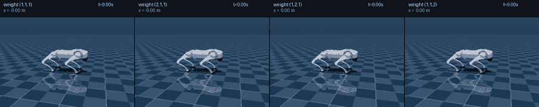
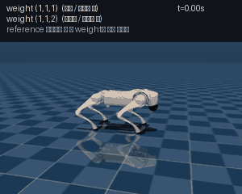
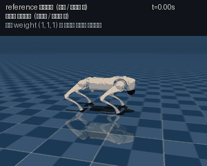

# 보행 task에서의 preference weight 합성: 무엇이 되고 무엇이 되지 않았는가

## 요약

네 발 로봇(Unitree Go2)이 앞으로 0.8 m/s로 걷는 문제에서, 사용자가 preference
weight를 바꾸면 걸음걸이가 달라지는 컨트롤러를 만들려 했다. 접근은 [외란 회복
보고서](push_recovery_report_ko.md)와 동일하다 — 몇 개의 weight에서 network를
학습해 두고 임의의 weight를 그 선형 결합으로 만든다.

**결과는 두 갈래로 갈린다.**

**성공한 것:** 개별 network가 reference 컨트롤러를 잘 모사한다. 검증 상대 오차
0.086, cosine similarity 0.989. 그리고 weight 하나를 고정하면 학습된 컨트롤러가
1,000 스텝(20초) 동안 낙상 없이 걷는다.

**실패한 것:** **합성이 이득을 주지 못했다.** 세 network를 섞은 결과가 여섯 개
목표 weight에서 평균 성능 비율 1.49~2.18인 반면, **network 하나만 그대로 쓴 것이
1.11**이었다. 즉 합성한 컨트롤러보다 합성하지 않은 컨트롤러가 나았다.

원인을 추적한 결과 학습이나 합성 수식의 문제가 아니었다. **보상 함수의 세 항목이
서로 충돌하지 않아서, reference 컨트롤러 자체가 weight에 따라 거의 같은 걸음을
만들고 있었다.** weight가 바꿀 것이 애초에 없었다.

이 문서는 그 진단 과정과, 그로부터 얻은 설계 조건을 기록한다. 여기서 밝힌 조건을
만족하도록 문제를 다시 설계한 것이 [외란 회복 task](push_recovery_report_ko.md)이며,
거기서는 같은 방법이 작동한다.

---

## 1. 이론적 배경

### 1.1 문제 설정

로봇은 앞으로 0.8 m/s로 걷는다. 컨트롤러는 12개 관절의 목표 토크를 50 Hz로 내보낸다.
평가 항목은 세 가지다.

| 이름 | 측정 대상 |
|---|---|
| **tracking** | 몸통 속도와 회전 속도가 목표값과 얼마나 다른가 |
| **stability** | 몸통이 얼마나 기울었는가 + 방향이 얼마나 틀어졌는가 + 높이가 얼마나 벗어났는가 |
| **gait** | 네 발의 높이가 정해진 trot 궤적에서 얼마나 벗어났는가 |

세 항목을 벡터 $C(x) \in \mathbb{R}^3$ 로 두고 weight $\omega \in \mathbb{R}^3$ 와
내적해 스칼라 목적함수를 만든다.

$$R(x;\ \omega) = \omega \cdot C(x)$$

$\omega = (1,1,1)$ 이 원래의 trot 보상을 정확히 재현하도록 항목을 나눴다.

### 1.2 Reference 컨트롤러와 학습 목표

기준 컨트롤러는 sampling 기반 model predictive controller다. 매 제어 스텝마다
현재 계획 주변에 Gaussian noise를 뿌려 2048개 변형을 만들고, 각각을 물리
시뮬레이터로 굴려 점수를 매긴 뒤, softmax 가중 평균으로 계획을 갱신한다.

이 갱신은 다음 Gibbs distribution의 **score**(로그 확률의 gradient)를 유한 sample로
추정하는 것과 같다.

$$p(U;\ \omega) \propto \exp\!\left(\frac{\omega \cdot C(U)}{T}\right)
\qquad\Longrightarrow\qquad
\nabla_U \log p = \frac{1}{T}\sum_{i=1}^{3} \omega_i\, \nabla_U C_i(U)$$

**score는 weight에 대해 linear다.** $\nabla_U C_i$ 세 개는 weight와 무관하게 고정된
대상이고, weight는 그것들을 섞는 계수일 뿐이다. 따라서 세 개의 weight에서 score를
network로 배워 두면 임의의 weight에서의 score를 선형 결합으로 만들 수 있다 — 이것이
이 접근 전체의 근거다.

### 1.3 합성 계수

basis weight $\{\omega_1, \omega_2, \omega_3\}$ 를 행으로 쌓은 행렬을 $B$ 라 하면,
목표 $\omega^*$ 에 대한 계수는 pseudoinverse로 얻는다.

$$a = \omega^{*\top} B^{+}, \qquad
\Delta_{\text{composed}} = \sum_i a_i\, \Delta_i$$

**basis 개수가 항목 개수를 넘으면 이 식이 무너진다.** $B$ 가 full row rank일 때만
$\omega^* = \omega_j$ 에 대해 $a = e_j$ 가 나온다. 항목이 3개인데 basis를 4개 쓰면
rank가 3에 묶이고, pseudoinverse는 최소 norm 해를 돌려주면서 계수가 0이어야 할
network들을 섞어 넣는다. 실측으로 확인된다.

| basis 개수 | 항목 개수 | basis 자신 재현 오차 |
|---|---|---|
| 3 | 3 | $8.3\times10^{-7}$ |
| 3 | 3 | $4.8\times10^{-7}$ |
| **4** | 3 | **2.00** (그리고 나머지 행 0.47~0.68) |

### 1.4 이 task에서 쓴 convention

당시에는 reference 컨트롤러의 sample 점수를 그 자신의 표준편차로 나누는 구현을 그대로
따랐다. 그 나눗셈은 갱신을 **weight의 크기에 무관**하게 만들어서, 최소제곱만으로는
합성 결과의 크기를 결정할 수 없다. 실제로 $(1,1,1)$ 목표가 방향은 cosine 0.9997로
맞으면서 크기가 40% 틀렸다. 계수의 합을 1로 맞추는 보정을 넣어 이를 2.4%로 줄였다.

> 이 보정은 나눗셈이 파괴한 정보를 되돌리려는 우회책이었다. 외란 회복 task에서는
> 나눗셈 자체를 제거하고 $\nu = \omega/T$ 공간에서 계수를 푸는 방식으로 바꿨으며,
> 그쪽이 크기까지 정확히 복원한다.

---

## 2. 학습 및 추론 framework

### 2.1 무엇을 배우는가

network는 상태 $x$, 현재 계획 $U$, annealing level $t$ 를 받아 **reference
컨트롤러가 그 상황에서 계획에 가할 갱신량**을 출력한다. 학습 target은 reference
컨트롤러의 실제 출력을 sampling 난수에 대해 평균한 값이다.

reference 컨트롤러의 noise는 노드별로 고정된 profile에 하나의 annealing factor를
곱한 형태다. network는 그 factor만을 조건으로 받으며, 학습과 추론에서 동일한
schedule을 쓴다.

network는 유계 갱신량을 출력하고 score는 그것을 $\sigma(t)^2$ 로 나눠 얻는다.
이 preconditioning이 없으면 출력 head가 $1/\sigma^2$ 전 범위를 표현해야 해서
학습이 되지 않는다. 첫 번째 노드의 갱신은 0으로 고정한다.

Loss는 $\sigma^4$ 가중 score regression이며, 이는 **실제로 적용되는 제어 갱신의
mean squared error** 와 같다.

### 2.2 추론

$$U \leftarrow \text{clip}\big(U + \Delta_{\text{composed}}(U, x, t),\ -1,\ 1\big)$$

annealing schedule을 한 바퀴 돌면 한 제어 스텝이 끝난다. 에피소드 첫 스텝에서는
schedule을 여러 번 반복해 0에서 출발한 계획을 수렴시킨다. 그다음 스텝부터는 이전
계획을 시간축으로 한 칸 밀어 warm start한다.

### 2.3 데이터 수집

수집은 reference 컨트롤러가 환경을 구동하며 진행하고, 매 상태에서 계획 자체와
계획을 일부러 밀어낸 query 여러 개에 대해 target을 받는다. 밀어낸 query가 필요한
이유는 배포 중 학습된 컨트롤러의 계획이 조금씩 어긋나는데, 그 지점에 label이 없으면
발산하기 때문이다.

이후 라운드는 **학습된 컨트롤러가 계획을 구동하되 target은 여전히 reference
컨트롤러가 붙이는** 방식으로 진행했다(dataset aggregation).

### 2.4 network 구성

basis weight마다 **완전히 독립된 network** 하나씩. 공유 trunk에 head를 여러 개
붙이는 구조는 쓰지 않았다 — 합성이 실패했을 때 공유 encoder가 원인 후보로 남지
않도록 하기 위해서다. 이 선택 덕분에 §4의 진단이 가능했다.

| 항목 | 값 |
|---|---|
| 구조 | fully connected, 512 × 3 layers |
| 학습 스텝 | 8,000 (network당) |
| 학습 데이터 | network당 141,000 ~ 296,000 query |
| sample 수 | 2,048 |
| annealing level | 2 (factor 1.0, 0.5) |
| planning horizon | 16 스텝 (0.32 s), spline node 5개 |

---

## 3. 개별 network는 잘 학습되었다

네 개의 basis weight에서 각각 network를 학습했다.

| network | weight | 학습 데이터 | 검증 상대 오차 | cosine | coarse level | fine level | label 자체 noise |
|---|---|---|---|---|---|---|---|
| A | (1,1,1) | 163,296 | **0.086** | 0.989 | 0.062 | 0.170 | 3.3% |
| B | (3,1,1) | 177,120 | 0.093 | 0.987 | 0.067 | 0.179 | 3.7% |
| C | (1,3,1) | 176,040 | **0.084** | 0.989 | 0.060 | 0.165 | 3.3% |
| D | (1,1,3) | 296,208 | 0.086 | 0.988 | 0.061 | 0.172 | 3.1% |

**cosine similarity 0.987~0.989는 매우 높은 값이다.** 학습 자체는 잘 되었다.

두 annealing level의 상대 오차가 3배 가까이 차이 나는 것(0.06 대 0.17)이 눈에
띈다. fine level의 갱신량이 본질적으로 작아서 mean squared error에 덜 기여하기
때문이며, 이는 이 loss 함수의 알려진 성질이다.

닫힌 루프 성능도 나쁘지 않다. weight를 하나로 고정하고 1,000 스텝(20초)을 굴리면:

| network | 평균 보상 | 낙상 |
|---|---|---|
| A (1,1,1) | −0.0907 | **0** |
| B (3,1,1) | −0.2207 | 1 |
| C (1,3,1) | −0.1133 | 2 |
| D (1,1,3) | −0.2900 | 2 |

---

## 4. 합성은 이득을 주지 못했다

### 4.1 측정 방법

여섯 개 목표 weight에서 합성된 컨트롤러와 reference 컨트롤러를 나란히 굴려 비교했다.
성능 비율은 (합성 컨트롤러 평균 보상) ÷ (reference 평균 보상)이며 1.0이 동일,
낮을수록 좋다.

**핵심은 대조군이다.** 합성한 결과를 reference와만 비교하면 "합성이 도움이 되는가"를
알 수 없다. **network 하나만 그대로 쓰는 것**을 함께 재야 한다.

### 4.2 결과

| 구성 | (1,1,1) | (2,1,1) | (1,2,1) | (1,1,2) | (2,2,1) | (5,5,3) | 평균 | 낙상 |
|---|---|---|---|---|---|---|---|---|
| 합성 A: (1,1,1)+(3,1,1)+(1,3,1) | 1.16 | 1.70 | 2.05 | 2.31 | 2.44 | 3.41 | **2.18** | 23 |
| 합성 B: (1,1,1)+(3,1,1)+(1,1,3) | 1.13 | 1.68 | 2.39 | 1.57 | 1.12 | 1.06 | **1.49** | 11 |
| 합성 C: 네 개 전부 (rank 부족) | 1.72 | 2.10 | 1.69 | 1.69 | 2.48 | 2.79 | **2.08** | 19 |
| **단일 network A (1,1,1)** | 1.15 | **0.94** | 1.19 | 1.25 | 1.04 | 1.06 | **1.11** | **0** |
| 단일 network C (1,3,1) | 1.34 | 1.15 | 1.37 | 1.47 | 1.27 | 1.25 | 1.31 | 18 |
| 단일 network D (1,1,3) | 1.91 | 1.74 | 2.09 | 2.03 | 1.91 | 1.96 | 1.94 | 18 |
| 단일 network B (3,1,1) | 2.40 | 1.99 | 2.57 | 2.64 | 2.24 | 2.30 | 2.36 | 7 |

(reference 컨트롤러는 여섯 목표 전부에서 낙상 0회)

**단일 network A가 모든 합성 구성보다 낫다.** 평균 1.11 대 1.49~2.18, 낙상 0회 대
11~23회. 게다가 그 network는 목표 weight를 **무시하고** 있는데도 그렇다 — 자기가
학습된 $(1,1,1)$ 하나만 쓴다.

이것이 이 task의 핵심 결과다. **합성이 실패한 것이 아니라, 합성할 가치가 없었다.**

### 4.3 그리고 basis 자신에서 더 나빴다

합성 A를 보면 목표가 basis 자신인 $(1,1,1)$ 에서 1.16으로 가장 좋고, 내부 목표로
갈수록 나빠져 $(5,5,3)$ 에서 3.41이 된다. 잘 작동하는 합성이라면 basis 자신에서
network 하나만 쓰이므로 그 값이 개별 network의 오차와 같아야 하고, 내부 목표는
그와 비슷해야 한다.

> [외란 회복 task](push_recovery_report_ko.md)에서는 basis 자신 1.135, 내부 목표
> 1.152로 차이가 +0.017에 불과하다. 이 대비가 두 task의 차이를 가장 압축적으로
> 보여 준다.

---

## 5. 원인 진단

합성 수식은 맞았고(§1.3의 재현 오차 $10^{-7}$), 개별 network도 잘 학습되었다(§3).
그렇다면 왜 합성이 무의미했는가.

### 5.1 reference 컨트롤러부터 weight에 반응하지 않는다

network를 빼고 **reference 컨트롤러만으로** 확인할 수 있다. 여섯 개 weight 각각으로
컨트롤러를 굴려 궤적을 얻은 뒤, 그 궤적들을 **모든 weight의 목적함수로 교차 채점**
한다. weight가 의미가 있다면 각 목적함수는 자기 weight로 만들어진 궤적을 가장 높게
평가해야 한다 — 즉 대각 성분이 이겨야 한다.

| 궤적을 만든 weight ↓ / 채점 weight → | (1,1,1) | (2,1,1) | (1,2,1) | (1,1,2) | (2,2,1) | (5,5,3) |
|---|---|---|---|---|---|---|
| (1,1,1) | −0.2224 | −0.2569 | −0.2302 | −0.4023 | −0.2648 | −0.7519 |
| (2,1,1) | −0.2137 | **−0.2335** | −0.2220 | −0.3993 | −0.2418 | −0.6973 |
| (1,2,1) | −0.2277 | −0.2627 | −0.2382 | −0.4099 | −0.2732 | −0.7741 |
| (1,1,2) | **−0.2105** | −0.2670 | **−0.2160** | **−0.3589** | −0.2725 | −0.7556 |
| (2,2,1) | −0.2180 | −0.2397 | −0.2275 | −0.4047 | **−0.2492** | −0.7164 |
| (5,5,3) | −0.2192 | −0.2429 | −0.2280 | −0.4058 | −0.2518 | −0.7227 |

**대각이 6개 중 2개에서만 이긴다.** $(1,1,1)$ 의 목적함수로 채점하면 $(1,1,2)$ 로
만든 궤적이 5.35% 더 좋고, $(1,2,1)$ 로 채점하면 역시 $(1,1,2)$ 궤적이 9.34% 더
좋다. 즉 **weight를 바꿔도 그 weight가 원하는 방향으로 궤적이 움직이지 않는다.**

이 격차가 측정 잡음일 가능성을 배제하기 위해, **같은 weight로 seed만 바꿔** 같은
표를 만들었다. 여섯 번 반복의 값이 −0.3451 ~ −0.3486 범위에 들어와 **변동폭이
약 1%** 였다. 위의 3~9% 격차는 잡음보다 크다. 즉 대각이 지는 것은 우연이 아니라
실제로 weight가 자기 목적을 최적화하지 못한다는 뜻이다.

### 5.2 왜 반응하지 않는가 — 세 항목이 충돌하지 않는다

weight가 의미를 가지려면 항목들이 **서로 충돌**해야 한다. 하나를 좋게 하면 다른
하나가 나빠지는 관계가 있어야 최적해가 weight에 따라 이동한다.

이 task의 세 항목은 그렇지 않다. **tracking, stability, gait 모두 "같은 하나의
nominal trot 궤적"으로부터의 편차에 대한 quadratic penalty다.**

- tracking: 그 궤적의 몸통 속도에서 벗어난 정도
- stability: 그 궤적의 몸통 자세·높이에서 벗어난 정도
- gait: 그 궤적의 발 높이에서 벗어난 정도

세 항목이 **같은 점에서 동시에 최소가 된다.** 그러면 어떤 weight를 주든 최적해가
그 한 점으로 같고, weight는 penalty basin의 곡률만 바꾼다. 최적해의 **위치**를
움직이지 못한다.

$$\text{모든 } i \text{ 에 대해 } \arg\min_x C_i(x) = x_{\text{trot}}
\quad\Longrightarrow\quad
\arg\min_x\ \omega \cdot C(x) = x_{\text{trot}} \quad \forall\, \omega > 0$$

### 5.3 시각적 확인

reference 컨트롤러를 네 개의 weight로 각각 굴린 결과다. 모두 동일한 초기 상태이며
**2배 느린 재생**이다.

**걸음걸이가 구분되지 않는다.** 3초 동안의 정량값도 마찬가지다.

| weight | 전진 거리 | 횡방향 이탈 | 평균 몸통 높이 | 높이 변동 |
|---|---|---|---|---|
| (1,1,1) | 1.970 m | 0.018 m | 0.291 m | 0.0107 |
| (2,1,1) | 1.984 m | 0.004 m | 0.291 m | 0.0090 |
| (1,2,1) | 1.964 m | 0.008 m | 0.293 m | 0.0104 |
| (1,1,2) | 1.929 m | 0.040 m | 0.279 m | 0.0109 |

전진 거리가 1.929~1.984 m로 **2.8% 안에 모여 있다.**

두 weight를 같은 화면에 겹쳐 보면 더 분명하다.

선명하고 따뜻한 색이 $(1,1,1)$, 반투명하고 차가운 색이 $(1,1,2)$ 다. **두 로봇이
거의 완전히 겹쳐서 하나로 보인다.** 세 항목 중 하나에 2배 weight를 준 것인데도
그렇다.

> 같은 표현 방식으로 그린 [외란 회복 task의 그림](push_recovery_report_ko.md#겹쳐-보기--몸통-수평-유지-vs-제자리-유지--090-ms)
> 에서는 두 로봇이 시간이 갈수록 뚜렷하게 벌어진다. 그 차이가 두 task의
> 본질적 차이다.

### 5.4 학습된 컨트롤러 자체는 동작한다

합성이 무의미했다는 것이 "학습이 실패했다"는 뜻은 아니다. 같은 weight에서 학습된
컨트롤러와 reference 컨트롤러를 겹쳐 보면:

선명한 쪽이 reference, 반투명한 쪽이 학습된 컨트롤러다. **둘 다 안정적으로 걷고**,
3초 뒤 전진 거리가 1.97 m 대 1.88 m로 **4.6% 차이**다. 보폭과 위상이 조금씩
어긋나면서 누적된 결과이며, 이것이 §3의 성능 비율 1.11에 해당하는 오차다.

---

## 6. 진단 과정에서 확인한 측정 함정들

합성이 무의미하다는 결론에 이르기까지, 잘못된 측정으로 몇 번 방향을 잘못 잡았다.
그때 확인된 것들은 이후 task 설계에 그대로 반영되었다.

### 6.1 각 컨트롤러를 자기가 방문한 상태에서 채점하면 비교가 아니다

컨트롤러 A를 굴려 그 상태들에서 A의 정확도를 재고, B를 굴려 B의 정확도를 재면,
두 숫자는 **서로 다른 시험지**의 점수다. 실제로 dataset aggregation 이후 $(1,3,1)$
network는 자기 상태에서 fine level cosine이 0.650 → 0.693으로 좋아졌지만, 같은
시점에 $(1,1,1)$ 의 상태에서는 0.332 → 0.295로 나빠졌다.

정확도는 **어느 상태 분포에서 잰 것인지**를 반드시 함께 말해야 한다.

### 6.2 평가 구간이 결과를 뒤집는다

관절 한계 종료 조건이 의도치 않은 안전망 역할을 하고 있었다. 학습된 컨트롤러가
약 167 스텝마다 리셋되면서 학습 분포 근처에 머물렀고, 그래서 400 스텝 평가는
cosine 0.961 / 성능 비율 1.15로 좋게 나왔다. **같은 컨트롤러를 3,000 스텝으로
평가하면 0.720 / 1.74였다.**

평가 구간은 배포 구간과 같아야 한다.

### 6.3 에피소드 길이는 데이터의 시간 범위를 결정한다

수집 예산을 고정한 채 에피소드를 길게 하면 초기 상태의 다양성을 그만큼 잃는다.
100 스텝에서 500 스텝으로 늘렸더니 라운드당 초기 조건이 8개에서 2개로 줄었고,
고치려던 것이 전부 나빠졌다 — 첫 낙상 294 → 230 스텝, 자기 상태에서의 cosine
0.822 → 0.720, fine level cosine 0.764 → 0.580.

에피소드를 늘리려면 총 예산을 늘려야지, 재배분해서는 안 된다.

### 6.4 dataset aggregation과 합성 품질은 서로 당긴다

dataset aggregation은 각 network를 자기가 방문하는 상태 쪽으로 끌어당긴다. 그런데
합성은 **어느 network의 것도 아닌 제3의 상태**에서 평가된다. 개별 network를 개선한
것이 오히려 합성을 악화시켰다 — $(1,2,1)$ 목표가 1.79 → 1.99로 나빠지는 동안 해당
network의 자체 검증 지표는 30% 좋아졌다.

합성을 위한 데이터는 **합성된 컨트롤러가 구동하면서** 모아야 한다.

### 6.5 basis weight 샘플링이 basis 자신을 굶긴다

내부 목표 weight를 simplex에서 균등 추출하면 꼭짓점 근처가 거의 뽑히지 않는다.
실제로 추출된 weight의 평균이 $[0.37, 0.42, 0.22]$ 였고, 그 결과 학습된 컨트롤러가
내부 목표에서는 괜찮은데($(2,1,1)$ 1.53, $(2,2,1)$ 1.62) **basis 자신인 $(1,1,1)$
에서 가장 나빴다(2.65).**

basis 자신이 배포 대상이라면 명시적으로 섞어 넣어야 한다.

### 6.6 규모가 바뀌면 그 실행은 다른 변수를 측정한다

수집 방식을 바꾸면서 저장 형식이 달라져 기존 데이터를 재사용할 수 없었고, network당
데이터가 12만~15.5만에서 48,840으로 줄었다. 그 상태로 학습을 돌리니 모든 network가
낙상 기준 4~6배 나빠졌다. 그 실행은 의도한 변수가 아니라 **데이터 감소량**을 측정한
것이었다.

> 이 경험이 [외란 회복 task](push_recovery_report_ko.md#21-데이터를-label이-아니라-sample로-저장한다)
> 에서 "label이 아니라 sample을 저장한다"는 설계로 이어졌다. sample을 저장해 두면
> weight·temperature·평균 횟수를 바꿔도 물리 시뮬레이션 없이 label만 다시 만들 수
> 있어, 이런 종류의 혼동이 원천적으로 생기지 않는다.

---

## 7. Discussion

### 7.1 이 task에서 확인된 것

**개별 score network는 잘 학습된다.** cosine 0.989, 상대 오차 0.086, 그리고 1,000
스텝 낙상 0회. 접근 자체의 학습 부분은 문제가 없다.

**합성 수식도 맞다.** basis 개수가 항목 개수 이하일 때 basis 자신 재현 오차가
$10^{-7}$ 이다.

**그러나 이 목적함수에서는 weight가 할 일이 없다.** reference 컨트롤러부터 weight에
반응하지 않으므로, 그것을 정확히 모사하는 network들을 아무리 잘 섞어도 얻을 것이
없다. 합성한 것이 단일 network보다 나쁜 이유는, 합성이 **아무 이득 없이 세 network의
근사 오차를 함께 들여오기** 때문이다.

### 7.2 얻은 설계 조건

이 task가 알려 준 것은 "이렇게 하면 안 된다"가 아니라 **"무엇을 먼저 확인해야
하는가"** 다.

**학습을 시작하기 전에, reference 컨트롤러만으로 weight의 판별력을 측정하라.**
§5.1의 교차 채점표를 만들고 대각이 이기는지 보면 된다. 이 검사는 network가 전혀
필요 없고, 이 task에서 몇 주를 쓰기 전에 돌렸다면 바로 답이 나왔을 것이다.

**항목들이 물리적으로 충돌하도록 설계하라.** 같은 nominal을 가리키는 penalty를
여러 개 나열하는 것으로는 부족하다. 어떤 편차에 반응하고 어떤 편차에 무감각한지의
패턴이 항목마다 달라야 한다.

**합성 결과는 반드시 "합성하지 않은 것"과 비교하라.** reference 컨트롤러와만 비교
하면 합성이 이득인지 손해인지 알 수 없다. 이 task에서 단일 network 대조군을 재기
전까지는 합성 A의 1.16이라는 숫자를 성공으로 오독하고 있었다.

**basis 개수 ≤ 항목 개수**, 그리고 선형 독립이어야 한다.

### 7.3 이 진단이 다음 task로 이어진 방식

여기서 나온 조건을 만족하도록 문제를 다시 설계한 것이
[외란 회복 task](push_recovery_report_ko.md)다. 달라진 점은 다음과 같다.

| | 보행 task | 외란 회복 task |
|---|---|---|
| 항목 설계 | 같은 nominal에 대한 penalty 3개 | 물리적으로 충돌하는 항목 4개 |
| 판별력 사전 검사 | 없음 (사후에 발견) | 학습 전에 통과시킴 (대각 4/4) |
| 대조군 | 뒤늦게 추가 | 처음부터 basis 자신을 목표에 포함 |
| 데이터 저장 | 완성된 label | sample (weight·temperature 사후 변경 가능) |
| weight scale | 미정의 (표준편차로 나눔) | unit vector로 고정 |
| 합성 공간 | $\omega$ + 합계 1 보정 | $\nu = \omega/T$ |
| **basis 자신 vs 내부 목표** | 1.16 vs 3.41 | **1.135 vs 1.152** |
| **단일 network 대조군 대비** | 합성이 **더 나쁨** | 해당 없음(합성이 오차를 안 더함) |

### 7.4 한계

**이 task를 살리는 방법을 끝까지 탐색하지는 않았다.** 세 항목을 충돌하도록 다시
설계하는 것 — 예를 들어 속도와 에너지, 또는 보폭 높이와 전진 속도처럼 물리적으로
경합하는 항목으로 바꾸는 것 — 은 가능했을 것이다. 실제로 에너지 항목을 시험했을
때는 planning horizon이 0.32초로 짧아 에너지-속도 trade-off의 시간 상수를 담지
못한다는 별도의 문제가 드러났다. 그 방향 대신 외란 회복 task로 옮겨 갔다.

**성능 비율은 절대 크기에 민감하다.** 목적함수의 값이 weight마다 크게 다르면
($(5,5,3)$ 의 reference 보상이 −0.266으로 $(1,1,1)$ 의 −0.076보다 3.5배 크다)
같은 크기의 거동 오차가 전혀 다른 비율로 환산된다. 이 표들을 목표 간에 직접
비교할 때는 주의해야 한다.

**단일 plant, 단일 task다.** 지면 마찰, 로봇 질량, actuator 특성은 모두 고정되어
있으며, domain randomization과 실기 이전은 다루지 않았다.

---

## 부록: 설정값

| 항목 | 값 |
|---|---|
| 환경 | Unitree Go2, 목표 전진 속도 0.8 m/s, trot |
| 제어 주기 | 50 Hz (dt = 0.02 s) |
| 물리 substep | 0.01 s |
| planning horizon | 16 스텝 (0.32 s), spline node 5개 |
| sample 수 | 2,048 |
| annealing level | 2 (factor 1.0, 0.5) |
| temperature | 0.05 (reference), 0.3 (수집 시) |
| basis weight | (1,1,1), (3,1,1), (1,3,1), (1,1,3) 중 3개 선택 |
| network | fully connected 512 × 3 |
| 학습 스텝 | 8,000 |
| 학습 데이터 | network당 141,000 ~ 296,000 query |
